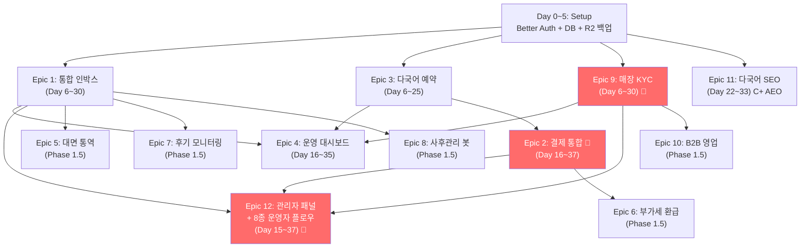

# Hesya Phase 1 — 개발 계획서 (DEVELOPMENT-PLAN v1.2 FINAL)

> **문서 버전**: v1.2 FINAL (검증·통합 완료)
> **작성일**: 2026-04-29
> **기준**: PRD v1.2 + DECISIONS v1.1 FINAL
> **프레임워크**: DBIAV (Design-Build-Inspect-Agent-Vault)
> **병렬화**: tmux + Git Worktrees + Claude Code Agent Teams
> **이 문서의 역할**: 일정·Task·병렬 작업 설계 단일 진실 공급원

---

## 0. Executive Summary (BLUF)

### 0.1 한 줄 요약

**Day 1~37 (5주) 안에 Better Auth + Next.js 16.2.4 + Supabase 기반 MVP를 tmux 6창 병렬로 완성하고 베타 5곳 배포.**

### 0.2 핵심 결정 종합

| 항목             | 결정                                                          |
| ---------------- | ------------------------------------------------------------- |
| **일정**         | Day 1~37 (5주, 안전 여유)                                     |
| **총 작업 시간** | 약 434h                                                       |
| **Epic 수**      | 12개 (1·2·3·4·5·6·7·8·9·10·11·12)                             |
| **tmux 창**      | 6개 (Lead + Worker 5명 + Reviewer + Monitor)                  |
| **Worktree**     | 6개 (main + 5개 feature)                                      |
| **에이전트**     | Lead (Opus 4.7) + Worker 5 (Sonnet 4.6) + Reviewer (Opus 4.7) |
| **단계별 비용**  | Day 0 +$0~3 → Day 30 +$28 → 매장 50~100곳 +$128               |

### 0.3 Day 1~37 핵심 산출물

- ✅ Better Auth + Google OAuth + 5단 RBAC + 멀티 매장
- ✅ 통합 다국어 인박스 (5채널 + Sonnet 4.6 RAG + Opus 4.7 Vision)
- ✅ 다국어 예약 시스템 (5개 언어 + 시간 슬롯 동기화)
- ✅ 매장 KYC 자동 검증 (국세청 + LOCALDATA + OCR + 키워드 + 8단계)
- ✅ 매장 운영 대시보드 (12 KPI + Bento 그리드)
- ✅ 결제 통합 위젯 🔴 (Stripe + Alipay + WeChat + LINE/PayPay/UnionPay)
- ✅ 관리자 패널 + 8종 운영자 플로우 풀세트 (Epic 12)
- ✅ SEO C+ + 핵심 AEO + WCAG AA 풀 + 핵심 페이지 AAA
- ✅ Day 0 R2 백업 + Day 30 Staging 환경
- 🎯 Day 37 Beta v0.1 시드 5곳 배포

---

## 1. DBIAV 프레임워크 적용

> 비율: **설계 35% / 빌드 15% / 검증 30% / 에이전트 10% / 축적 10%**

### 1.1 ① 설계 Design (35%) — Day 0 ~ Day 5

**책임**: Jayden + AI Lead (Opus 4.7 + xhigh effort)

| 작업                        | 산출물                                       |
| --------------------------- | -------------------------------------------- |
| 인터뷰 30곳 가이드          | INTERVIEW-GUIDE.md (이미 존재)               |
| 시드 5곳 LOI                | B2B-OUTREACH-AUTOMATION.md 활용              |
| 아키텍처 설계               | `docs/architecture.md`                       |
| DB 스키마 v0001             | `packages/database/migrations/0001_init.sql` |
| API 계약                    | `packages/shared-types/contracts/`           |
| 디자인 토큰 + UI 라이브러리 | `packages/shared-ui/`                        |

### 1.2 ② 빌드 Build (15%) — Day 6 ~ Day 35

**책임**: Worker 에이전트들 (Sonnet 4.6) — Lead가 분배

- 한 Task 30분~2시간 단위
- Ralph Loop 자동 수정 (빌드 통과까지 자동 반복)
- 서브에이전트 `@` 멘션으로 직접 호출

### 1.3 ③ 검증 Inspect (30%) — Day 6 ~ Day 37 (빌드 병행)

**책임**: Reviewer 에이전트 (Opus 4.7) + 자동화

| 검증 단계             | 도구                                         | 빈도            |
| --------------------- | -------------------------------------------- | --------------- |
| Task 완료 시 4단 자동 | tsc + eslint + next build + vitest           | 매 Task         |
| PR 생성 시 코드 리뷰  | `@code-reviewer` (Sonnet 4.6, Fresh Context) | 매 PR           |
| PR 생성 시 보안 검토  | `@security-reviewer` (Opus 4.7)              | 🔴 모듈 필수    |
| /ultrareview          | Opus 4.7 전용 리뷰 세션                      | 주 1회 (금요일) |
| OAR 보고              | Observation / Action / Rationale             | 매 Task 완료    |

### 1.4 ④ 에이전트 Agent (10%) — Day 6 ~ Day 37

**책임**: Lead Agent (Opus 4.7)

- Agent Teams 활성화: `CLAUDE_CODE_EXPERIMENTAL_AGENT_TEAMS=1`
- tmux 6창 + Git Worktree 6개
- Advisor tool: Sonnet 4.6 executor + Opus 4.7 advisor
- Task Budgets: Epic당 토큰 상한

### 1.5 ⑤ 축적 Vault (10%) — 매일

**책임**: 모든 에이전트

- `docs/learnings.md` 매일 업데이트
- 트리거: 에러 2회 반복 / 30분+ 소요 / AI 방향 이탈 / 설계 결정
- 형식: 증상 → 원인 → 해결 → **규칙**
- `docs/PROGRESS.md` 매일 자정 업데이트

---

## 2. Epic 의존성 분석

### 2.1 Epic 12개 + 의존성 그래프



### 2.2 병렬 가능 매트릭스

| Day   | 동시 진행 Epic             | 병렬 워커 수                   |
| ----- | -------------------------- | ------------------------------ |
| 0~5   | Setup (Lead 단독)          | 1                              |
| 6~14  | Epic 1·3·9                 | 3                              |
| 15~21 | Epic 1·3·9·4·11·12         | 5                              |
| 22~28 | Epic 1·9·4·11·12·2         | 5 (booking 완료, payment 시작) |
| 29~37 | Epic 12·11·2 + 통합 테스트 | 3~5                            |

### 2.3 충돌 위험 영역 (Lead 단독 관리)

| 영역                                         | 이유                    |
| -------------------------------------------- | ----------------------- |
| `packages/database/migrations/`              | 마이그레이션 번호 충돌  |
| `packages/shared-types/`                     | 타입 충돌 → 컴파일 실패 |
| `next.config.ts`, `proxy.ts`, `package.json` | 글로벌 설정             |
| `.env.local` 스키마                          | 환경변수 통합 검증      |
| Supabase RLS 정책                            | 보안 결정               |

---

## 3. Epic별 Task 분해

### 3.1 Setup (Day 0~5, Lead 단독, 약 50h)

| #                | Task                                              | 시간 |
| ---------------- | ------------------------------------------------- | ---- |
| S-1              | Next.js 16.2.4 + Turbopack + AGENTS.md 생성       | 1h   |
| S-2              | 모노레포 구조 (pnpm workspaces)                   | 2h   |
| S-3              | Supabase Pro 활성화 + 환경변수 셋업               | 2h   |
| S-4              | DB Schema v0001 (PRD § 7)                         | 4h   |
| S-5              | RLS 정책 v0001                                    | 4h   |
| S-6              | Zod + TypeScript 타입 (shared-types)              | 4h   |
| S-7              | Server Actions + Route Handlers 스켈레톤          | 3h   |
| S-8              | shadcn/ui + 디자인 토큰 (디자인 시스템 v3.0)      | 4h   |
| S-9              | next-intl 5개 언어 (ko, en, ja, zh-CN, zh-TW, vi) | 3h   |
| S-10             | Sentry + PostHog 셋업                             | 2h   |
| S-11             | GitHub Actions CI (tsc + eslint + build + test)   | 3h   |
| S-12             | Vercel + Supabase 배포 파이프라인                 | 2h   |
| S-13             | `.claude/agents/` 정의 (5개 Worker + Reviewer)    | 2h   |
| S-14             | `CLAUDE.md` 작성 (200줄 이내)                     | 2h   |
| S-15             | `docs/PROGRESS.md` 초기화                         | 1h   |
| S-16             | `docs/learnings.md` 초기화                        | 1h   |
| S-17             | Hook 셋업 (Prettier, Validate, PostCompact)       | 2h   |
| **S-18** ⭐ v1.1 | **Better Auth + Google OAuth + 자체 가입 셋업**   | 5h   |
| **S-19** ⭐ v1.1 | **멀티테넌시 DB (`store_owners` 조인)**           | 4h   |
| **S-20** ⭐ v1.1 | **Cloudflare R2 외부 백업 (cron, 매주 일요일)**   | 6h   |
| **S-21** ⭐ v1.1 | **Tiptap 에디터 컴포넌트**                        | 6h   |
| **S-22** ⭐ v1.1 | **PWA Service Worker + Web Push**                 | 6h   |

### 3.2 Epic 1 — 통합 다국어 인박스 (Day 6~30, 56h, 🟡 YELLOW)

**담당**: `@worker-inbox` (Sonnet 4.6, advisor: Opus 4.7)
**파일 영역**: `apps/web/app/(store)/inbox/`, `apps/web/lib/inbox/`, `apps/web/lib/ai/`, `n8n-workflows/inbox/`, `supabase/functions/inbox-webhook/`

| #     | Task                                          | 시간 |
| ----- | --------------------------------------------- | ---- |
| E1-1  | Instagram Graph API 연동                      | 4h   |
| E1-2  | WhatsApp Business API 연동                    | 4h   |
| E1-3  | 카카오 비즈니스 메시지 연동                   | 6h   |
| E1-4  | LINE Messaging API 연동                       | 4h   |
| E1-5  | Facebook Messenger 연동                       | 4h   |
| E1-6  | 통합 인박스 UI + Tiptap 답변 작성             | 8h   |
| E1-7  | Claude Sonnet 4.6 자동 응답 + 매장별 RAG      | 8h   |
| E1-8  | 다국어 자동 번역 (5개 언어)                   | 4h   |
| E1-9  | 매장별 FAQ 학습 (RAG 인덱싱 자동화)           | 6h   |
| E1-10 | Claude Opus 4.7 Vision (2,576px, task_budget) | 4h   |
| E1-11 | 응답 정확도 검증 (베타 50건)                  | 8h   |

### 3.3 Epic 3 — 다국어 예약 시스템 (Day 6~25, 30h, 🟡 YELLOW)

**담당**: `@worker-booking` (Sonnet 4.6)
**파일 영역**: `apps/web/app/(customer)/booking/`, `apps/web/app/(store)/calendar/`, `apps/web/lib/booking/`, `packages/translations/store-content/`

| #                | Task                                       | 시간 |
| ---------------- | ------------------------------------------ | ---- |
| E3-1             | DB Schema 인덱스 추가                      | 2h   |
| E3-2             | 매장 다국어 페이지 (next-intl 동적 라우트) | 6h   |
| E3-3             | 시술 메뉴·디자이너 포트폴리오 다국어       | 4h   |
| E3-4             | 시간 슬롯 동기화 (네이버·카카오 캘린더)    | 6h   |
| E3-5             | 노쇼 방지 예약금 30% 플로우 (UI만)         | 2h   |
| E3-6             | 예약 → 결제 → 메시지 통합 (Epic 2 mock)    | 4h   |
| **E3-7** ⭐ v1.1 | **WCAG AA 풀 + 핵심 페이지 AAA 적용**      | 6h   |

### 3.4 Epic 9 — 매장 KYC 자동 검증 (Day 6~30, 60h, 🔴 RED)

**담당**: `@worker-kyc` (Sonnet 4.6) + `@security-reviewer` (Opus 4.7) 필수
**파일 영역**: `apps/web/app/(admin)/kyc/`, `apps/web/app/(store)/onboarding/`, `apps/web/lib/kyc/`, `supabase/functions/kyc-{nts,localdata,ocr,keyword}/`

| #                 | Task                                        | 시간 |
| ----------------- | ------------------------------------------- | ---- |
| E9-1              | 공공데이터포털 API Key (국세청 + LOCALDATA) | 2h   |
| E9-2              | 국세청 사업자등록 진위확인 API              | 4h   |
| E9-3              | LOCALDATA 미용업 매칭 로직 (퍼지 매칭)      | 8h   |
| E9-4              | 카테고리 자동 분류 (9 카테고리)             | 6h   |
| E9-5              | 약관 자기신고 UI + DB                       | 4h   |
| E9-6              | Claude Opus 4.7 Vision 영업신고증 OCR       | 6h   |
| E9-7              | 위험 키워드 자동 차단 (50개+)               | 4h   |
| E9-8              | 매뉴얼 검토 큐 UI (관리자)                  | 6h   |
| E9-9              | 가입 통과/거절 알림 (다국어)                | 2h   |
| E9-10             | 분기별 자동 재검증 (cron)                   | 4h   |
| E9-11             | 외부 신고 채널                              | 6h   |
| E9-12             | 검증 로그·감사 추적 (immutable)             | 4h   |
| **E9-13** ⭐ v1.1 | **거절 알림 다국어 + 음성 안내 (AAA 핵심)** | 4h   |

### 3.5 Epic 4 — 매장 운영 대시보드 (Day 16~35, 22h, 🟡 YELLOW)

**담당**: `@worker-dashboard` (Sonnet 4.6)
**파일 영역**: `apps/web/app/(store)/dashboard/`, `apps/web/lib/analytics/`

| #    | Task                                   | 시간 |
| ---- | -------------------------------------- | ---- |
| E4-1 | Recharts 12 KPI 위젯 (Bento 그리드)    | 8h   |
| E4-2 | 국적·시술·디자이너별 분석              | 6h   |
| E4-3 | 모바일 반응형 (768/480 브레이크포인트) | 4h   |
| E4-4 | Supabase Materialized Views            | 4h   |

### 3.6 Epic 2 — 결제 통합 위젯 🔴 (Day 16~37, 42h, 🔴 RED)

**담당**: **Lead 직접 작성** + `@security-reviewer` 필수 (n8n 절대 사용 금지)
**파일 영역**: `apps/web/app/api/payments/`, `apps/web/lib/payments/`, `supabase/functions/payment-webhook/`

| #    | Task                                   | 시간 |
| ---- | -------------------------------------- | ---- |
| E2-1 | Stripe Korea 등록 + SDK                | 4h   |
| E2-2 | Alipay+ Connect                        | 6h   |
| E2-3 | WeChat Pay + 한도 분할 (6,000 CNY)     | 8h   |
| E2-4 | LINE Pay·PayPay·UnionPay               | 6h   |
| E2-5 | 한국은행 환율 API (5분 캐시)           | 2h   |
| E2-6 | Escrow 자동화 (Supabase Edge Function) | 6h   |
| E2-7 | 노쇼 자동 환불 (24h 후 80%)            | 4h   |
| E2-8 | 결제 위젯 UI 다국어                    | 6h   |

### 3.7 Epic 11 — 다국어 SEO C+ + 핵심 AEO (Day 22~33, 16h, 🟢 GREEN) ⭐ v1.1 변경

**담당**: `@worker-seo` (Sonnet 4.6) — Worker 1·9가 손비면 시간 분산 가능
**파일 영역**: `apps/web/app/sitemap.ts`, `apps/web/app/robots.ts`, `packages/translations/seo/`

| #     | Task                                               | 시간 |
| ----- | -------------------------------------------------- | ---- |
| E11-1 | 메타·sitemap·robots 기본                           | 4h   |
| E11-2 | LocalBusiness Schema.org + hreflang 5개            | 4h   |
| E11-3 | 다국어 sitemap (언어별 분리)                       | 2h   |
| E11-4 | Naver/Bing/Baidu/Yandex Webmaster 등록             | 2h   |
| E11-5 | FAQ 스키마 (Question-led H2) — 검증된 +28% AI 인용 | 2h   |
| E11-6 | 매장별 영문 요약 (E-E-A-T)                         | 2h   |

> ⚠️ 이전 D 옵션의 llms.txt·동적 OG 이미지는 효과 미검증으로 제거 (Search Engine Journal 30만 도메인 연구).

### 3.8 Epic 12 — 관리자 패널 + 8종 운영자 플로우 (Day 15~37, 60h, 🔴 RED) ⭐ v1.1 신규

**담당**: `@worker-admin` (Sonnet 4.6) + `@security-reviewer` (Opus 4.7) 필수
**파일 영역**: `apps/web/app/(admin)/`, `apps/web/lib/admin/`, `supabase/functions/admin-*`
**Worktree**: `hesya-admin` (신규)

| #      | Task                                        | 시간 |
| ------ | ------------------------------------------- | ---- |
| E12-1  | Admin 라우트 + 인증 가드 (Admin 역할)       | 4h   |
| E12-2  | KYC 매뉴얼 검토 큐 UI + 액션 (SLA 24~48h)   | 8h   |
| E12-3  | 외부 신고 처리 (SLA 6h 긴급/72h 일반)       | 6h   |
| E12-4  | 분쟁 처리 (노쇼·환불·컴플레인, SLA 5영업일) | 6h   |
| E12-5  | 분기별 재검증 결과 처리 큐                  | 4h   |
| E12-6  | 결제 이상 거래 모니터링 🔴 (매일)           | 6h   |
| E12-7  | AI 응답 정확도 모니터링 (즉시 알림)         | 4h   |
| E12-8  | API 정책 변경 대응 (n8n RSS 연동)           | 4h   |
| E12-9  | 매장 해지·데이터 삭제 (개인정보보호법 30일) | 6h   |
| E12-10 | 감사 로그 (immutable audit log + RLS)       | 4h   |
| E12-11 | 통합 테스트 + UAT (시드 5곳 시뮬레이션)     | 6h   |

### 3.9 Day 28~30 Staging 셋업 ⭐ v1.1 신규 (Lead 직접, 8h)

| #    | Task                                         | 시간 |
| ---- | -------------------------------------------- | ---- |
| SS-1 | Supabase 별도 프로젝트 `hesya-staging` 생성  | 2h   |
| SS-2 | Vercel Preview Deploy + Staging DB 자동 연결 | 3h   |
| SS-3 | GitHub Actions: PR 머지 → Staging → Prod     | 3h   |

### 3.10 Phase 1.5 (Day 38~120) — 후순위

| Epic                                          | 기간      | 담당                |
| --------------------------------------------- | --------- | ------------------- |
| Epic 5 — 대면 통역 PWA (Whisper + ElevenLabs) | Day 46~90 | Worker (Sonnet 4.6) |
| Epic 6 — 부가세 환급 (변호사 검수 후)         | Day 60~90 | Lead + 변호사       |
| Epic 7 — 후기 모니터링 (n8n 크롤링)           | Day 60~90 | Worker + n8n        |
| Epic 8 — 사후관리 봇 (1·7·30일 자동)          | Day 60~90 | Worker + n8n        |
| Epic 10 — B2B 영업 자동화                     | Day 38~60 | Worker + n8n        |

---

## 4. tmux 6창 병렬 작업 설계

### 4.1 사전 준비 (Day 0)

#### Agent Teams 활성화

```bash
export CLAUDE_CODE_EXPERIMENTAL_AGENT_TEAMS=1
export CLAUDE_CODE_THINKING=adaptive
export AUTOCOMPACT_PCT=50
export ENABLE_PROMPT_CACHING_1H=1
```

#### Git Worktree 6개

```bash
cd ~/hesya

git checkout main
git worktree add ../hesya-inbox     -b feat/epic1-inbox
git worktree add ../hesya-booking   -b feat/epic3-booking
git worktree add ../hesya-kyc       -b feat/epic9-kyc
git worktree add ../hesya-dashboard -b feat/epic4-dashboard
git worktree add ../hesya-admin     -b feat/epic12-admin   # ⭐ v1.1 신규
git worktree add ../hesya-payment   -b feat/epic2-payment  # Day 16~ Lead 직접
```

#### worktree.sparsePaths

각 worktree에 `.claude/settings.json`:

```json
{
  "worktree": {
    "sparsePaths": [
      "apps/web/app/(store)/inbox/**",
      "apps/web/lib/inbox/**",
      "apps/web/lib/ai/**",
      "n8n-workflows/inbox/**",
      "supabase/functions/inbox-webhook/**",
      "packages/shared-types/src/inbox.ts",
      "packages/translations/**"
    ]
  }
}
```

### 4.2 tmux 세션 구성 (6창)

```
Window 0: Lead     (Opus 4.7)              ← DB 마이그레이션·shared-types·통합·결제
Window 1: inbox    Worker (Sonnet 4.6)     ← Epic 1 (Day 6~30)
Window 2: booking  Worker (Sonnet 4.6)     ← Epic 3 (Day 6~25)
Window 3: kyc      Worker (Sonnet 4.6)     ← Epic 9 (Day 6~30) 🔴
Window 4: dashboard Worker (Sonnet 4.6)    ← Epic 4 (Day 16~35)
Window 5: admin    Worker (Sonnet 4.6)     ← Epic 12 (Day 15~37) 🔴
Window 6: reviewer Reviewer (Opus 4.7)     ← 보안·코드 리뷰 전담
Window 7: monitor  로그                    ← Supabase·Vercel·Sentry
```

### 4.3 launch 스크립트 (`scripts/start-agent-team.sh`)

```bash
#!/bin/bash
# Day 6 시작 시 한 번 실행

SESSION="hesya-day6"

tmux has-session -t $SESSION 2>/dev/null
if [ $? != 0 ]; then
  tmux new-session -d -s $SESSION -n "lead"

  # Window 0: Lead
  tmux send-keys -t $SESSION:0 "cd ~/hesya && claude --model opus" Enter

  # Window 1: Inbox Worker
  tmux new-window -t $SESSION:1 -n "inbox"
  tmux send-keys -t $SESSION:1 "cd ~/hesya-inbox && claude --model sonnet --agent worker-inbox" Enter

  # Window 2: Booking Worker
  tmux new-window -t $SESSION:2 -n "booking"
  tmux send-keys -t $SESSION:2 "cd ~/hesya-booking && claude --model sonnet --agent worker-booking" Enter

  # Window 3: KYC Worker (🔴 보안)
  tmux new-window -t $SESSION:3 -n "kyc"
  tmux send-keys -t $SESSION:3 "cd ~/hesya-kyc && claude --model sonnet --agent worker-kyc" Enter

  # Window 4: Dashboard Worker (Day 16~)
  tmux new-window -t $SESSION:4 -n "dashboard"
  tmux send-keys -t $SESSION:4 "cd ~/hesya-dashboard && claude --model sonnet --agent worker-dashboard" Enter

  # Window 5: Admin Worker (Day 15~) ⭐ v1.1 신규
  tmux new-window -t $SESSION:5 -n "admin"
  tmux send-keys -t $SESSION:5 "cd ~/hesya-admin && claude --model sonnet --agent worker-admin" Enter

  # Window 6: Reviewer
  tmux new-window -t $SESSION:6 -n "reviewer"
  tmux send-keys -t $SESSION:6 "cd ~/hesya && claude --model opus --agent security-reviewer" Enter

  # Window 7: Monitor
  tmux new-window -t $SESSION:7 -n "monitor"
  tmux send-keys -t $SESSION:7 "cd ~/hesya && pnpm supabase logs -f" Enter
fi

tmux attach-session -t $SESSION
```

### 4.4 Lead의 일일 책임

```
[매일 09:00 KST]
1. PROGRESS.md 확인 → 어제 완료·오늘 할 Task
2. Worker 5명에게 Task 분배 (Agent Teams 메시징)
3. DB 마이그레이션 필요 시 Lead 직접 작성 → Worker git pull 알림
4. shared-types 변경 시 Lead 통합 → 전 Worker rebase 지시

[Worker 충돌 시]
5. Lead가 conflict 해결 → main 머지 → Worker rebase

[매일 18:00 KST]
6. 5개 worktree에서 PR 생성 → Reviewer 자동 호출
7. Reviewer 통과 → main 머지 → 다음 날 rebase

[매주 금요일]
8. /ultrareview (Opus 4.7) — 한 주 코드 전체 리뷰
9. learnings.md 업데이트
10. 주간 보고서 (Notion·Slack·이메일)
```

### 4.5 충돌 방지 7대 규칙

| #   | 규칙                                                   | 위반 시                 |
| --- | ------------------------------------------------------ | ----------------------- |
| 1   | `packages/database/migrations/` Lead 단독              | 번호 충돌 → 빌드 실패   |
| 2   | `packages/shared-types/` Lead 통합                     | 타입 충돌 → 컴파일 실패 |
| 3   | `next.config.ts`, `proxy.ts`, `package.json` Lead 단독 | 글로벌 설정 충돌        |
| 4   | `.env.local` 스키마 Zod로 검증                         | 환경변수 누락           |
| 5   | 공용 컴포넌트 (`shared-ui`) Lead 승인 필수             | 디자인 일관성           |
| 6   | Supabase RLS는 Lead + Reviewer 합의                    | 보안 정책 위반          |
| 7   | 각 Worker는 자기 worktree만 sparsePaths                | 권한 거부               |

### 4.6 Task Budgets (비용 폭주 방지)

```json
// .claude/settings.json
{
  "taskBudgets": {
    "epic1-inbox": { "maxTokens": 500000, "model": "sonnet" },
    "epic2-payment": { "maxTokens": 800000, "model": "opus" }, // 🔴
    "epic3-booking": { "maxTokens": 300000, "model": "sonnet" },
    "epic4-dashboard": { "maxTokens": 200000, "model": "sonnet" },
    "epic9-kyc": { "maxTokens": 700000, "model": "sonnet+opus-advisor" },
    "epic11-seo": { "maxTokens": 200000, "model": "sonnet" },
    "epic12-admin": { "maxTokens": 600000, "model": "sonnet+opus-advisor" }
  }
}
```

---

## 5. 검증 게이트

### 5.1 자동 검증 4단 (모든 Task)

```bash
# scripts/validate.sh — Ralph Loop 자동 실행
#!/bin/bash
set -e

echo "🔍 1/4 TypeScript..."
pnpm tsc --noEmit

echo "🔍 2/4 ESLint..."
pnpm eslint . --max-warnings=0

echo "🔍 3/4 Build (Turbopack)..."
pnpm next build

echo "🔍 4/4 Test..."
pnpm vitest run --reporter=verbose

echo "✅ 모든 검증 통과"
```

**규칙**: 1단이라도 실패 → 다음 Task 금지. Ralph Loop 자동 수정 (최대 20회 반복).

### 5.2 보안 게이트 (🔴 RED 모듈만)

```bash
# scripts/security-validate.sh
#!/bin/bash
set -e

echo "🔒 1/3 Secret 스캔 (gitleaks)..."
gitleaks detect --source . --verbose

echo "🔒 2/3 의존성 취약점 (npm audit)..."
pnpm audit --audit-level=high

echo "🔒 3/3 Claude security-reviewer..."
claude --agent security-reviewer "지금 PR 검토 + Next.js CVE 패턴"

echo "🔒 보안 게이트 통과"
```

### 5.3 Day 37 Beta v0.1 게이트

| 게이트                     | 통과 조건                             |
| -------------------------- | ------------------------------------- |
| Better Auth + Google OAuth | 5단 RBAC 모두 작동                    |
| Epic 1 인박스              | 5채널 + AI 응답 정확도 90%+           |
| Epic 3 예약                | 5개 언어 + 시간 슬롯 동기화           |
| Epic 9 KYC                 | 시드 5곳 자동 통과율 80%+             |
| Epic 4 대시보드            | 12 KPI 모두 작동                      |
| Epic 12 관리자             | 8종 플로우 시나리오 통과              |
| Epic 2 결제                | Stripe·Alipay·WeChat 테스트 카드 통과 |
| Epic 11 SEO                | Lighthouse SEO 90+                    |
| WCAG AA                    | axe-core CI 통과 + 키보드 탐색        |
| 핵심 페이지 AAA            | 예약·결제·KYC 색상 대비 7:1           |
| R2 외부 백업               | 첫 백업 + 복구 테스트 통과            |
| Staging 환경               | PR 자동 배포 동작                     |
| 검증 4단                   | 100% 통과                             |

→ 통과 시 **Beta v0.1 시드 5곳 배포**.

---

## 6. Day 1~37 간트차트

```
Week 1 (Day 1~7) — Setup + 인터뷰
├─ Day 1~5 : Setup S-1~S-22 (22 Task)              [Lead]
├─ Day 1~7 : 인터뷰 30곳 + 시드 5곳 LOI             [Jayden]
├─ Day 4~5 : Better Auth 학습 + R2 백업 셋업         [Lead]
└─ Day 6   : tmux 6창 launch + 일일 사이클 시작      [전체]

Week 2 (Day 8~14) — Epic 1·3·9 시작
├─ inbox    : E1-1~E1-4 (5채널 연동)
├─ booking  : E3-1~E3-3 (DB·다국어 페이지·디자이너)
└─ kyc 🔴  : E9-1~E9-4 (API·NTS·LOCALDATA·카테고리)

Week 3 (Day 15~21) — + Epic 4·12·11 시작
├─ inbox    : E1-5~E1-7 (UI·AI 응답·RAG)
├─ booking  : E3-4~E3-7 (시간 슬롯·a11y AAA)
├─ kyc      : E9-5~E9-9 (자기신고·OCR·키워드·매뉴얼)
├─ dashboard: E4-1~E4-2 (KPI·분석)
├─ admin 🔴: E12-1~E12-4 (Admin·KYC큐·신고·분쟁) ⭐
└─ payment 🔴: E2-1~E2-3 [Lead] (Stripe·Alipay·WeChat)

Week 4 (Day 22~28) — 통합 테스트 + Staging 준비
├─ inbox    : E1-8~E1-11 (번역·FAQ·Vision·검증)
├─ booking  : 시드 5곳 데이터 입력 + UAT
├─ kyc      : E9-10~E9-13 (재검증·신고·감사·다국어 음성)
├─ dashboard: E4-3~E4-4 (반응형·MV)
├─ admin    : E12-5~E12-9 (재검증큐·결제·AI·API·해지)
├─ payment  : E2-4~E2-7 [Lead]
├─ seo      : E11-1~E11-4 (메타·Schema·hreflang·웹마스터)
└─ Day 28~30 : ⭐ Staging 셋업 (SS-1~SS-3) [Lead]

Week 5 (Day 29~37) — 마무리 + 베타 출시
├─ Day 29~30 : /ultrareview 세션 + 게이트 점검
├─ Day 31~33 : Epic 12 완료 (E12-10·E12-11)
├─ Day 31~33 : Epic 11 마무리 (E11-5·E11-6 FAQ·E-E-A-T)
├─ Day 33    : Alpha v0.2 → Beta v0.1 게이트 점검
├─ Day 35    : 최종 통합 테스트 + 보안 검토 (/security-review)
└─ Day 37    : 🎯 Beta v0.1 시드 5곳 배포
```

### 6.1 단계별 도입 (Q12·Q13)

| 시점              | 항목                   | 비용     |
| ----------------- | ---------------------- | -------- |
| **Day 0**         | R2 외부 주간 백업 셋업 | +$0~3/월 |
| **Day 28~30**     | Staging 환경 추가      | +$25/월  |
| **매장 50~100곳** | PITR 28일 추가         | +$100/월 |

---

## 7. 폴더 구조

```
hesya/                                   # main worktree
├── README.md                              # 5분 인덱스
├── PRD.md                                 # 비즈니스
├── DECISIONS.md                           # 기술 결정
├── DEVELOPMENT-PLAN.md                    # 본 문서
├── apps/
│   └── web/                               # Next.js 16.2.4
│       ├── app/
│       │   ├── (store)/
│       │   │   ├── inbox/                 # ← Worker-inbox
│       │   │   ├── calendar/              # ← Worker-booking
│       │   │   ├── dashboard/             # ← Worker-dashboard
│       │   │   └── onboarding/            # ← Worker-kyc
│       │   ├── (customer)/
│       │   │   └── booking/               # ← Worker-booking
│       │   ├── (admin)/                   # ← Worker-admin (Epic 12)
│       │   │   ├── kyc-queue/
│       │   │   ├── reports/
│       │   │   ├── disputes/
│       │   │   ├── revalidations/
│       │   │   ├── payments/
│       │   │   ├── ai-quality/
│       │   │   ├── api-policy/
│       │   │   └── store-deletion/
│       │   └── api/
│       │       ├── auth/[...all]/         # Better Auth
│       │       ├── payments/              # 🔴 Lead 단독
│       │       └── webhooks/              # 외부 webhook (Route Handlers)
│       ├── lib/
│       │   ├── auth.ts                    # Better Auth (Lead)
│       │   ├── inbox/                     # Worker-inbox
│       │   ├── booking/                   # Worker-booking
│       │   ├── kyc/                       # Worker-kyc
│       │   ├── analytics/                 # Worker-dashboard
│       │   ├── admin/                     # Worker-admin
│       │   ├── ai/                        # Worker-inbox (공유)
│       │   └── payments/                  # 🔴 Lead 단독
│       ├── proxy.ts                       # Lead 단독 (NOT middleware.ts!)
│       ├── next.config.ts                 # Lead 단독
│       ├── instrumentation.ts             # Lead 단독 (Sentry)
│       └── i18n/
├── packages/
│   ├── database/
│   │   └── migrations/                    # 🔒 Lead 단독
│   ├── shared-types/                      # 🔒 Lead 단독
│   ├── shared-ui/                         # Lead 승인 필요
│   └── translations/                      # Worker 분산 가능
├── supabase/
│   └── functions/
│       ├── inbox-webhook/                 # Worker-inbox
│       ├── kyc-{nts,localdata,ocr}/       # Worker-kyc
│       ├── payment-webhook/               # 🔴 Lead 단독
│       ├── weekly-backup/                 # ⭐ Lead R2 백업
│       └── admin-{audit,export,delete}/   # Worker-admin
├── n8n-workflows/                         # 🟡 YELLOW 모듈만
│   ├── inbox/
│   ├── after-care/                        # Phase 1.5
│   └── b2b-outreach/                      # Phase 1.5
├── scripts/
│   ├── start-agent-team.sh                # tmux 6창 launch
│   ├── validate.sh                        # 4단 검증
│   └── security-validate.sh               # 🔴 보안 검증
├── .claude/
│   ├── agents/
│   │   ├── worker-inbox.md
│   │   ├── worker-booking.md
│   │   ├── worker-kyc.md
│   │   ├── worker-dashboard.md
│   │   ├── worker-admin.md                # ⭐ v1.1 신규
│   │   ├── code-reviewer.md
│   │   └── security-reviewer.md
│   ├── settings.json                      # taskBudgets
│   └── hooks.json
├── docs/
│   ├── learnings.md                       # 매일 업데이트
│   └── PROGRESS.md                        # 매일 업데이트
├── CLAUDE.md                              # 200줄 이내
└── AGENTS.md                              # Next.js 16 자동 생성
```

---

## 8. 리스크 대응

### 8.1 개발 리스크 (DR1~DR7)

| ID  | 리스크                               | 확률 | 영향   | 완화                                               |
| --- | ------------------------------------ | ---- | ------ | -------------------------------------------------- |
| DR1 | tmux 6창 인지 부담                   | 중   | 중     | Lead 중앙 통제 + Worker sparsePaths                |
| DR2 | Git worktree merge conflict          | 중   | 고     | DB 마이그레이션·shared-types Lead 단독 + 매일 머지 |
| DR3 | Agent Teams 실험 기능 불안정         | 저   | 고     | 폴백: tmux 6창 + 수동 Claude Code 6 인스턴스       |
| DR4 | Opus 4.7 토크나이저 1.0~1.35x        | 중   | 중     | count_tokens API 사전 측정 + Task Budgets          |
| DR5 | Next.js 16 proxy.ts 누락             | 저   | 고     | Setup 단계 grep 검사                               |
| DR6 | KYC false positive 정상 매장 거절 🔴 | 중   | 매우고 | LOCALDATA 매칭 실패 시 매뉴얼 큐 + 5일 SLA         |
| DR7 | 인스타·왓츠앱 API 검토 7~14일        | 고   | 중     | Day 1 신청, mock 데이터로 병행                     |

### 8.2 시장 리스크 자동 모니터링

```
n8n 워크플로우 (매일 06:00):
1. 보건복지부·법무부 RSS (무비자 정책 변경)
2. 강남언니·크리에이트립 보도자료 (R6)
3. Anthropic·Vercel·Supabase changelog
4. CVE 데이터베이스 (Next.js 보안)
→ 변경 감지 시 Slack #market-radar 알림
```

---

## 9. 총 시간·비용 정산

### 9.1 시간

| 카테고리          | 시간                                      |
| ----------------- | ----------------------------------------- |
| Setup (S-1~S-22)  | 약 50h                                    |
| Epic 1 인박스     | 56h                                       |
| Epic 3 예약       | 30h                                       |
| Epic 9 KYC        | 60h                                       |
| Epic 4 대시보드   | 22h                                       |
| Epic 2 결제       | 42h                                       |
| Epic 11 SEO       | 16h                                       |
| Epic 12 관리자    | 60h                                       |
| Day 28~30 Staging | 8h                                        |
| **Phase 1 합계**  | **약 344h** (병렬 5명 + Lead, 캘린더 5주) |

### 9.2 비용 (단계별)

| 시점              | 월 비용       |
| ----------------- | ------------- |
| Day 0 (Setup)     | 약 11만 원    |
| Day 30 (베타 5곳) | 약 32만 원    |
| 매장 50곳         | 약 189만 원   |
| 매장 100곳        | 약 386만 원   |
| Y3 600곳          | 약 2,244만 원 |

📄 상세: `DECISIONS.md` § 2

---

## 10. 다음 액션

### 10.1 즉시 실행 가능 (Jayden 결정 전)

1. GitHub Private Repo 생성 (`hesya`)
2. Cloudflare 계정 + R2 버킷 사전 생성
3. Google Cloud Console + OAuth Client (Phase 1)
4. 도메인 결정·구매
5. Better Auth 공식 문서 사전 학습 (Lead 3~4h)

### 10.2 D3 결정 후 즉시 시작

1. Vercel Pro·Supabase Pro 활성화
2. Day 0 Setup S-1 (Next.js 16.2.4 프로젝트 생성) 시작
3. tmux 6창 launch 스크립트 준비
4. Worktree 6개 생성

### 10.3 Day 1~14 병행

- 인터뷰 30곳 + 시드 5곳 LOI (Jayden)
- 결과로 D1 시드 위치 자연 결정

---

**문서 끝.**

> 본 v1.2 FINAL은 Day 1~37 실행 계획 단일 진실 공급원입니다.
> Day 0 Setup 시작 일자(D3) 결정 시 즉시 실행 가능 상태입니다.
