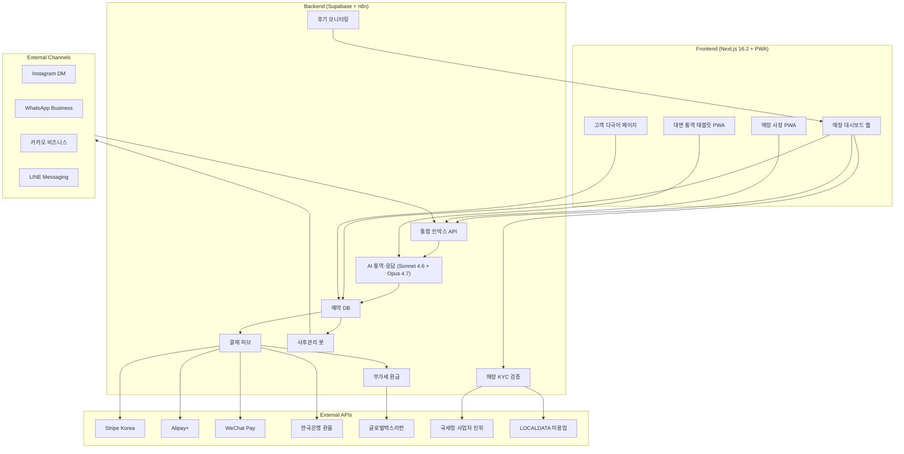
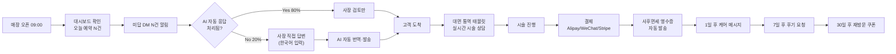
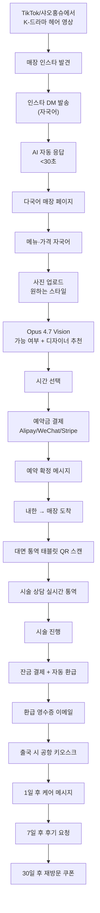
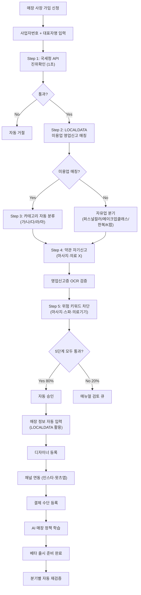
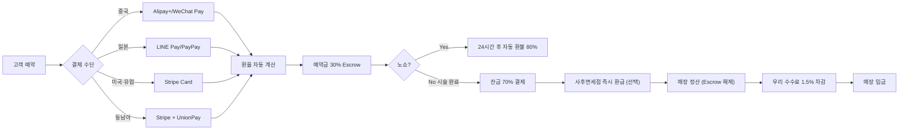

# Hesya (가칭) — K-Beauty 인바운드 SaaS · Phase 1 PRD

> **문서 정보**
>
> - **버전**: v1.2 (2026-04-29 기준 최신 정보 검증 반영)
> - **작성일**: 2026-04-29
> - **이전 버전**: v1.0 → v1.1 → v1.2 변경 사항은 § Appendix B 참조
> - **작성자**: Jayden + AI Lead Engineer (Claude Opus 4.7)
> - **단계**: Phase 1 (미용 only, Day 1~180)
> - **검증 기준일**: 2026-04-29 (보건복지부 2026.04.24 발표, 강남언니 KOS 동향 2026.03~04, 의료법 2025.07.31 시행 기준)
> - **부속 문서**:
>   - `MARKETING-PLAN-Phase1.md` (마케팅 계획서)
>   - `B2B-OUTREACH-AUTOMATION.md` (매장 영업 자동화)
>   - `INFLUENCER-DISCOVERY-GUIDE.md` (인플루언서 발굴)
>   - `MULTILINGUAL-SEO-STRATEGY.md` (다국어 SEO)
>   - `INTERVIEW-GUIDE.md` (인터뷰 가이드 — 이전 작성)

---

## 0. Executive Summary (1-Pager BLUF)

### 0.1 한 줄 정의

**전국 K-뷰티 매장(미용업 5종 + 자유업 4종)이 외국인 손님을 직접 잡을 수 있게 해주는 다국어 통합 운영 SaaS. 단, 마사지·의료 영역 일체 제외.**

### 0.2 핵심 가치 제안

| 대상              | 핵심 가치                                         | 정량 효과 (목표)                     |
| ----------------- | ------------------------------------------------- | ------------------------------------ |
| **매장 (사장)**   | 영어 능통 직원 채용 없이 외국인 손님 응대 가능    | 외국인 매출 월 200만 → 3,000만 원    |
| **고객 (외국인)** | 한국 앱 없이 인스타·왓츠앱으로 예약·결제·통역     | 시술 만족도 8.0/10 → 9.5/10          |
| **우리**          | 매장 데이터 락인으로 마켓플레이스보다 견고한 사업 | Y3 ARR 약 17.5억 (Phase 1 미용 only) |

### 0.3 시장 검증 (1차 출처, 2026.04.29 검증 완료)

- 외국인 환자: **2025년 201만 명** (보건복지부 2026.04.24, 전년 117만 대비 +72%) 🟢
- 의료관광 총액: **12.5조 원** (산업연구원 2026.04, 생산유발 22.8조 원·부가가치 10.5조 원) 🟢
- 외국인 미용 이용률: **18.5%** (2019년 3.6% 대비 5배, 서울관광재단 2025) 🟢
- **피부과 진료 비중 62.9% (131.3만 명)** — 의료관광의 60%+가 미용·피부 (보건복지부 2026.04) 🟢
- **부산 외국인 환자 +151.5%, 제주 +114.7%** (서울 +75.6% 대비, 보건복지부 2026.04) 🟢
- **부산 1분기 외국인 거래액 +530%** (크리에이트립 2026.04 발표, 서울 외 최고 성장률) 🟢
- 비수도권 외국인 구매 +80배 (올리브영, 2022 대비, 이지경제 2026.02.16) 🟢
- **롯데백화점 비수도권 외국인 매출 +100% (2026 1Q), 부산 본점 +110%** (이투데이 2026.04.27) 🟢
- **크리에이트립 헤드스파 거래액 +192%, 한의원 +138배** (2026.03 발표) 🟢
- 부산 미용 매장 외국인 응대 사례 활성 (서면 'ㄴ'헤어 등 2년 매출 +50%, KNN 2026.01) 🟢
- **Phase 1 (미용) SOM Y3: 약 17.5억 ARR** 🟡
- **Phase 1+2 (의료 추가) 통합 SOM Y3: 약 110~125억 ARR** 🟡

### 0.4 차별화 (Hamilton Helmer 7 Powers — v1.2 강화)

- **Counter-Positioning** 🆕 강화:
  - **강남언니**: 의료(피부과·성형외과) SaaS 영역 진입 중 (KOS 시스템, 언니가이드 센터 2026.03 오픈) → **Hesya는 비의료 미용업(헤어/네일/메이크업)에 집중**
  - **크리에이트립**: 마켓플레이스 (거래액 +72%, 제휴처 2,000곳) → **Hesya는 매장 직접 락인 SaaS, 거래액 % 수수료 없음**
  - **시장 공백**: 비의료 미용업 5종 + 자유업 4종 통합 SaaS는 **선두 부재**
- **Switching Costs**: 외국인 CRM 데이터·재방문 이력·다국어 FAQ RAG 락인 (이전 시 매출 손실)
- **Process Power**: 모듈 8개 통합 운영 노하우 (단일 기능 도구로 대체 불가)

### 0.5 Not Doing (Phase 1 명시)

**기능적 Not Doing**:

1. ❌ 의료 영역 일체 (피부과·성형외과·한의원·치과 — Phase 2)
2. ❌ 마켓플레이스/거래액 % 수수료 (강남언니 판례 회피)
3. ❌ 시술 쿠폰/티켓 직접 판매 (전자상거래법·표시광고법 회피)
4. ❌ 한국인 손님 응대 기능 (외국인 전용 SaaS)
5. ❌ 비자 발급/대행
6. ❌ 자체 결제 정산 (PG 등록 회피)
7. ❌ 외국인용 자체 앱 (한국 앱 다운로드 안 함)
8. ❌ 자체 POS 하드웨어·소프트웨어 개발 (Toss·BC카드 API 연동만)
9. ❌ 자체 의료광고 (의료법 56조 회피)

**카테고리 Not Doing — 가입 절대 금지** 🔴 (v1.2 처벌 강도 정확화):

1. ❌ 마사지·발마사지·스포츠마사지·아로마·경락·산모·림프 (의료법 무자격 안마행위, **3년 이하 징역 또는 3천만 원 이하 벌금**) 🔴
2. ❌ 안마시술소·스파·테라피·스웨디시·타이마사지·중국식 마사지 시설 개설 (의료법 88조 1호, **5년 이하 징역 또는 5천만 원 이하 벌금**) 🔴 ⚠️ v1.2 신규 명시
3. ❌ 한방 시술·한의원 (의료해외진출법) 🔴
   - ⚠️ **시장 트레이드오프**: 한의원은 크리에이트립 거래액 +138배 (2026.03)로 가장 빠르게 성장 중인 카테고리지만, 법적 안전성을 위해 **의도적으로 포기**. Phase 2에서 변호사 자문 후 재검토.
4. ❌ 의료기기 사용 매장 (LED·고주파·울쎄라·인모드·레이저·IPL — Phase 2) 🔴
5. ❌ 시각장애인 안마시술소 (별도 시장)

**시장적 Not Doing**:

1. ❌ Phase 1에서 미국·유럽 매장 (한국 인바운드 only)
2. ❌ Phase 1에서 B2C 직접 (B2B2C 모델)

---

## 1. Problem & Opportunity

### 1.1 매장 측 문제 (Store Problems)

| #    | 문제                                                              | 1차 출처               |
| ---- | ----------------------------------------------------------------- | ---------------------- |
| P-S1 | 외국인 손님 인스타 DM·왓츠앱 응답에 매장당 **주 10시간+ 소요**    | 한국경제 2026.03.03 🟢 |
| P-S2 | 영어 능통 직원 채용 어려움 (청담 매장 "영어 과외 지원" 채용 공고) | 한국경제 2026.03.03 🟢 |
| P-S3 | 통역사 비용 부담 (강남메디컬투어센터: 2시간 후 시간당 3만 원)     | 강남구청 약관 2025 🟢  |
| P-S4 | 알리페이·위챗페이 가맹점 등록·운영 불편, 결제 누수 발생           | 위챗페이 정책 2026 🟢  |
| P-S5 | 노쇼·예약금 환불 처리 수작업 (외국인 환자 약 5% 비자 미발급)      | 이투데이 2026.02.03 🟢 |
| P-S6 | SNS 평판 모니터링 부담 (Google·Naver·샤오홍슈·Insta 동시)         | 이투데이 2026.02.03 🟢 |
| P-S7 | 외국인 응대로 한국인 손님 만족도 하락 (시술 지연)                 | KB자산운용 2024 🟢     |
| P-S8 | 외국인 마케팅 비용 1인당 50~100만 원 (강남 클리닉 기준)           | 이투데이 2026.02.03 🟢 |

### 1.2 고객 측 문제 (Customer Problems)

| #    | 문제                                                                            | 1차 출처               |
| ---- | ------------------------------------------------------------------------------- | ---------------------- |
| P-C1 | 네이버·카카오 헤어샵 한국어 전용, 외국인 사용 불가                              | FOHO Blog 2025.10 🟢   |
| P-C2 | 비아시아계 모발/피부 처리 가능 매장 찾기 어려움                                 | FOHO Blog 2025.10 🟢   |
| P-C3 | 영어/일본어/중국어 가능 디자이너 매칭 정보 부족                                 | FOHO Blog 2025.10 🟢   |
| P-C4 | 알리페이·위챗페이 한도 (월 5만 위안, 건당 6천 위안) + 200위안 초과 시 3% 수수료 | 위챗페이 정책 2026 🟢  |
| P-C5 | 시술 후 본국 사후관리 가이드 없음                                               | 강남언니 분석 2025 🟢  |
| P-C6 | K-드라마/K-팝 스타일 직접 재현 요청 채널 부재                                   | 한국경제 2026.03.03 🟢 |
| P-C7 | 인스타 DM 매장에 보내도 시차/언어로 답변 지연                                   | FOHO Blog 2025.10 🟢   |
| P-C8 | 부가세 환급 절차 복잡 (사후면세점 미운영 매장 多)                               | 국세청 2024 🟢         |

### 1.3 기회 (Why Now) — v1.2 가설 재정립

⚠️ **v1.1의 "의료→미용 풍선효과" 가설은 v1.2에서 제거**. 의료(미용성형) VAT 환급은 의료기관(피부과·성형외과)에 적용되었던 제도이므로, 미용업(헤어/네일)으로의 자동 이전 논리는 약함. 대신 아래 **K-뷰티 자연 성장 가설**로 대체.

1. **K-뷰티 인바운드 폭발적 자연 성장** 🆕:
   - 외국인 환자 117만 → 201만 (전년 +72%, 보건복지부 2026.04.24) 🟢
   - 외국인 미용 이용률 5년간 5배 상승 (서울관광재단 2025) 🟢
   - **헤드스파 거래액 +192%, 한의원 +138배** (크리에이트립 2026.03) 🟢

2. **지방 K-뷰티 시장 폭발 — 비수도권 골든 시즌** 🆕:
   - **부산 1분기 외국인 거래액 +530%** (크리에이트립 2026.04, 서울 외 최고 성장률) 🟢
   - 부산 외국인 환자 +151.5%, 제주 +114.7% (서울 +75.6% 대비, 보건복지부 2026.04) 🟢
   - 롯데백화점 비수도권 외국인 매출 +100%, 부산 본점 +110% (2026 1Q, 이투데이 2026.04.27) 🟢
   - **신세계 부산 센텀시티점 +98%, 스파랜드 이용객 절반이 외국인** 🟢

3. **중일 갈등의 한국 K-뷰티 반사이익** 🆕:
   - 중국 정부, 자국민 일본행 비자 신청 60% 감축 지시 (2026.3월~, 교도통신·헤럴드경제 2025.12) 🟢
   - 한국행 중국인 단체 무비자 정책 (2025.9.29~2026.6.30 시행 중) 🟢
   - 결과: **2025년 중국 환자 +137.5%, 대만 +122.5% 폭증** (보건복지부 2026.04) 🟢

4. **AI 통역 기술 성숙**:
   - **Claude Opus 4.7 (2026.04.16 출시)** + Sonnet 4.6 다국어 실시간 통역 가능 🟢
   - Opus 4.7 고해상도 이미지 (2,576px) 지원 → 사진 업로드 시 시술 가능 여부 정밀 판단 🟢

5. **결제 인프라 성숙**:
   - Stripe·Alipay+ Connect 외국 카드 직결 가능 (2024.07~) 🟢
   - WeChat Pay 200 CNY 미만 3% 수수료 면제 (2025.05~, 베이징시 정책) 🟢

6. **경쟁 공백 + 임박한 시장 침입** ⚠️ v1.2 강화:
   - 강남언니=의료 (KOS 병원 SaaS 개발 중, 언니가이드 센터 2026.03.04 오픈) → **이미 SaaS 영역 진입 시작**
   - 크리에이트립=마켓플레이스 (거래액 +72%, 제휴처 2,000곳)
   - **비의료 미용업 매장 SaaS = 선두 부재 — 18~24개월 골든 윈도우 추정** 🟡

---

## 2. Users (페르소나)

### 2.1 매장 페르소나 (Store Personas)

#### 페르소나 S1: "홍대 외국인 90% 매장 사장 — 김지영 (38)"

- **매장**: 헤어샵, 4명 직원, 홍대입구역 도보 5분
- **상황**: 외국인 비중 90%, 인스타·왓츠앱 DM 일 30~50건
- **페인**: 새벽까지 DM 답변, 직원 영어 부담, 알리페이 결제 매번 수기 처리
- **현재 도구**: 인스타 비즈니스, 카카오톡, 수기 장부
- **예산**: 월 20~30만 원까지 SaaS 지불 가능

#### 페르소나 S2: "강남 종합 살롱 원장 — 박민수 (45)"

- **매장**: 헤어+두피+메이크업 종합, 8명 직원, 강남구
- **상황**: 외국인 비중 30%, 한국인+외국인 혼합 응대
- **페인**: 외국인 응대로 한국인 손님 시술 지연, SNS 평판 관리 어려움
- **현재 도구**: 자체 예약 시스템, 카카오, 인스타
- **예산**: 월 24.9~39.9만 원

#### 페르소나 S3: "명동 프랜차이즈 매장 매니저 — 이수진 (32)"

- **매장**: 준오헤어급 프랜차이즈, 12명 직원, 명동
- **상황**: 외국인 80%, 본사 시스템 따로 있음, 영어 직원 1명
- **페인**: 본사 시스템에 외국인 기능 부족, 영어 직원 1명에 의존
- **현재 도구**: 본사 POS, 자체 인스타
- **예산**: 본사 승인 필요, 월 19.9만 원이 마지노선

#### 페르소나 S4: "부산 서면 헤어샵 사장 — 최승원 (35)" ⚠️ v1.2 시장 검증 완료

- **매장**: 부산 서면, 헤어 컨설팅·퍼스널컬러, 인스타 7천+ 팔로워
- **상황**: 외국인 비중 25%, "foreigner book DM" 인스타 명시
- **페인**: 서울보다 외국인 정보 부족, 다국어 응대 도구 X
- **시장 시그널**: KNN 2026.01 보도 — 서면 'ㄴ'헤어 외국인 마케팅으로 2년 매출 +50%, 중화권 SNS 콘텐츠로 자연 예약 유입
- **예산**: 월 9.9~19.9만 원

#### 페르소나 S5: "홍대 퍼스널컬러 컨설턴트 — 장혜원 (29)"

- **매장**: 홍대 퍼스널컬러 진단 자유업 (Klook 가맹)
- **상황**: 외국인 80%, K-뷰티 글로우업 트렌드
- **페인**: 외국인 예약 인스타 DM, 결제 수단 부족
- **카테고리**: 자유업 (미용업 신고 X, 사업자등록증만)
- **예산**: 월 9.9만 원 (Basic 티어)

### 2.2 고객 페르소나 (Customer Personas)

#### 페르소나 C1: "도쿄 OL 일본인 — 사쿠라 (29)"

- **국적**: 일본
- **목적**: K-드라마 "더 글로리" 송혜교 스타일 헤어컷 + 두피 케어
- **체류**: 2박 3일
- **결제**: PayPay, 일본 신용카드 (VISA)
- **언어**: 일본어, 영어 약간
- **채널**: 인스타그램, Trip.com, 트위터
- **예산**: 30~50만 원

#### 페르소나 C2: "상하이 인플루언서 중국인 — 리 메이 (26)" ⚠️ v1.2 시장 시그널 강화

- **국적**: 중국
- **목적**: 메이크업 + 헤어 + 네일 풀 패키지 (K-팝 룩)
- **체류**: 4박 5일
- **결제**: 알리페이, 위챗페이, UnionPay (건당 6천 위안 한도, 분할 처리 자동화 필요)
- **언어**: 중국어 (간체), 영어 약간
- **채널**: 샤오홍슈, 더우인, 위챗
- **예산**: 100~200만 원
- **시장 시그널**: 2025년 중국 환자 +137.5% 폭증 (보건복지부) + 중일 갈등으로 일본행 차단된 중국인 한국 유입 예상 + 단체 무비자 정책 (2025.9.29~2026.6.30, 연장 미정)

#### 페르소나 C3: "캘리포니아 유학생 미국인 — Emma (24)"

- **국적**: 미국
- **목적**: 한국식 레이어드 컷 + 가는 모발 트리트먼트
- **체류**: 1주일
- **결제**: 미국 신용카드, Apple Pay
- **언어**: 영어
- **채널**: Instagram, Reddit r/Korea, TripAdvisor
- **예산**: $200~$500
- **시장 시그널**: 미국 환자 +70.4% (보건복지부 2026.04), K-두피케어 미국 고객 비중 37% (크리에이트립 2025.12)

---

## 3. Requirements — 매장 요구 vs 고객 요구

### 3.1 매장 요구사항 (Store Requirements)

| #        | 요구                                                        | 우선순위 |
| -------- | ----------------------------------------------------------- | -------- |
| **R-S1** | 통합 인박스 (Instagram·WhatsApp·카카오·LINE·Facebook 5채널) | 🔴 P0    |
| **R-S2** | AI 다국어 자동 응답 (5개 언어 + 매장별 RAG)                 | 🔴 P0    |
| **R-S3** | 결제 통합 위젯 (Stripe·Alipay·WeChat·LINE·PayPay·UnionPay)  | 🔴 P0    |
| **R-S4** | 매장 운영 대시보드 (외국인 매출·재방문·국적 분석)           | 🔴 P0    |
| **R-S5** | AI 실시간 대면 통역 (PWA 태블릿)                            | 🟡 P1    |
| **R-S6** | 다국어 후기 자동 수집 (Google·Naver·샤오홍슈·Insta)         | 🟡 P1    |
| **R-S7** | 자동 사후관리 메시지 (1·7·30일)                             | 🟡 P1    |
| **R-S8** | 다국어 마케팅 자동화 (SNS 콘텐츠 자동 생성)                 | 🟢 P2    |

### 3.2 고객 요구사항 (Customer Requirements)

| #        | 요구                                                | 우선순위 |
| -------- | --------------------------------------------------- | -------- |
| **R-C1** | 다국어 검색·발견 (5개 언어 + 비아시아계 모발 필터)  | 🔴 P0    |
| **R-C2** | 인스타·왓츠앱 즉시 예약 (한국 앱 다운로드 X)        | 🔴 P0    |
| **R-C3** | 모국 결제 수단 (Alipay·WeChat·PayPay·LINE·UnionPay) | 🔴 P0    |
| **R-C4** | AI 실시간 통역 (대면, QR 즉시 시작)                 | 🟡 P1    |
| **R-C5** | 본국 사후 케어 (다국어 가이드)                      | 🟡 P1    |
| **R-C6** | 부가세 자동 환급 (사후면세점)                       | 🟡 P1    |
| **R-C7** | 다국어 후기·평점 (디자이너별 포트폴리오)            | 🟡 P1    |
| **R-C8** | 한국 여행 통합 일정 (Phase 2)                       | 🟢 P2    |

---

## 4. Features — 8개 모듈 (Phase 1 MVP)

### 모듈 1. 통합 다국어 인박스 🔴 P0 (MVP)

- Instagram Graph API, WhatsApp Business API, 카카오 비즈니스 메시지, LINE Messaging API
- 단일 매장 대시보드 통합
- AI 1차 자동 응답 (Claude Sonnet 4.6 + 매장별 RAG)
- 사장 한국어 답변 → 자동 번역 → 고객 언어 발송
- 사진 업로드 시 **Claude Opus 4.7 Vision (2,576px 고해상도)** 시술 가능 여부 판단 🆕

### 모듈 2. 결제 통합 위젯 🔴 P0 (MVP)

- Stripe (글로벌), Alipay+ Connect (외국인 한도 우회), WeChat Pay (단일 6,000위안 분할)
- LINE Pay·PayPay (일본), UnionPay (중국 본토)
- 실시간 환율 (한국은행 Open API)
- 예약금 30% Escrow + 노쇼 자동 환불 (24h)
- 매장 직접 가맹점 (우리는 정보 전달, PG 등록 회피) 🟢

### 모듈 3. 다국어 예약 시스템 🔴 P0 (MVP)

- 매장 다국어 페이지 (영·일·중간·중번·베트남어)
- 시술 메뉴·디자이너 포트폴리오 다국어
- 시간 슬롯 자동 동기화 (네이버·카카오)
- 노쇼 방지 예약금 30%

### 모듈 4. AI 실시간 대면 통역 🟡 P1 (Phase 1.5)

- 매장 태블릿 PWA
- 음성 → 텍스트 → 번역 → 음성 (양방향, < 2초)
- 미용/시술 전문 용어 사전
- 오프라인 모드 (Whisper.cpp + 로컬 LLM)

### 모듈 5. 사후면세점 부가세 환급 자동화 🟡 P1 (Phase 1.5)

- 매장 사후면세점 등록 컨설팅 (조세특례제한법 107조)
- 즉시 환급 POS 통합 (1.5만~50만 원)
- 다국어 환급 가이드
- **Note**: 의료(미용성형) 부가세 환급은 2025.12.31 종료 ✅ 검증됨. 일반 사후면세점 (재화 구매)은 유지. 미용업 서비스 적용 가능 여부는 변호사 자문 필수 (Open Question 12.1.1)

### 모듈 6. 다국어 후기 자동 수집 🟡 P1 (Phase 1.5)

- Google·Naver·인스타·샤오홍슈·트립어드바이저 통합
- 신규 후기 24시간 이내 매장 알림
- AI 다국어 답변 초안 제공

### 모듈 7. 매장 운영 대시보드 🔴 P0 (MVP)

- 외국인 예약·매출·재방문률 (일/주/월)
- 국적·시술·디자이너별 분석
- 노쇼율, 평균 객단가, NPS

### 모듈 8. 다국어 마케팅 자동화 🟢 P2 (Phase 2)

- SNS 콘텐츠 다국어 자동 생성 (인스타·샤오홍슈·트위터)
- 인플루언서 발굴 (해시태그 분석)
- ROI 자동 측정

---

## 5. Flows — 5종 플로우 다이어그램

### 5.1 시스템 플로우



### 5.2 운영 플로우 (매장 직원의 일과)



### 5.3 고객 사용자 플로우



### 5.4 매장 사용자 플로우 (KYC 검증 5단계 포함)



### 5.5 결제 플로우



---

## 6. Architecture & Tech Stack (디바이스 전략 통합)

### 6.1 디바이스별 솔루션

| 사용자      | 디바이스                    | 플랫폼                                 | Phase          |
| ----------- | --------------------------- | -------------------------------------- | -------------- |
| 매장 사장   | 노트북 PC                   | 반응형 웹 (Next.js 16.2)               | Phase 1        |
| 매장 사장   | 폰                          | PWA (Phase 1) → React Native (Phase 2) | Phase 1·2      |
| 매장 직원   | 매장 태블릿 (iPad/갤럭시탭) | PWA 통역 도구                          | Phase 1        |
| 매장 직원   | POS 단말                    | Toss·BC카드 API 연동                   | Phase 1.5      |
| 외국인 고객 | 폰                          | 반응형 웹 (다국어)                     | Phase 1 (앱 X) |
| 외국인 고객 | 인스타·왓츠앱·라인          | 외부 채널 연동                         | Phase 1        |

### 6.2 기술 스택 ⚠️ v1.2 버전 갱신

| 레이어                  | 기술                                        | 버전·비고                                                                        |
| ----------------------- | ------------------------------------------- | -------------------------------------------------------------------------------- |
| **프레임워크**          | **Next.js 16.2**                            | App Router, **Turbopack stable (기본)**, React 19.2 ⚠️ v1.2 갱신                 |
| **언어**                | TypeScript Strict + Zod                     | 타입 안전                                                                        |
| **DB·인증·실시간**      | Supabase                                    | Postgres + Auth + Realtime + Storage + Edge Functions                            |
| **AI 응답·번역**        | **Claude Sonnet 4.6**                       | 일상 응답·번역 (80% 트래픽)                                                      |
| **AI 복잡 분석·Vision** | **Claude Opus 4.7**                         | 2026.04.16 출시. 시술 사진 분석(2,576px 고해상도), task_budget 활용 ⚠️ v1.2 갱신 |
| **워크플로우**          | n8n                                         | 메시지 발송·후기 크롤링·환급 처리·B2B 영업 자동화 (Elest.io 셀프호스팅)          |
| **UI**                  | shadcn/ui + Tailwind CSS + Pretendard 폰트  | 디자인 시스템 v3.0 적용                                                          |
| **상태 관리**           | Zustand + TanStack Query                    |                                                                                  |
| **다국어**              | next-intl + AI 자동 번역                    | 5개 언어 + 베트남어                                                              |
| **모바일**              | PWA (Phase 1) → Expo React Native (Phase 2) |                                                                                  |
| **결제**                | Stripe Korea + Alipay+ Connect + WeChat Pay |                                                                                  |
| **POS 연동**            | Toss Smart POS API + BC카드 PG (Phase 1.5)  |                                                                                  |
| **배포**                | Vercel + Supabase Cloud                     |                                                                                  |
| **모니터링**            | Sentry + Posthog                            |                                                                                  |
| **CI/CD**               | GitHub Actions                              |                                                                                  |

**v1.2 신규 — Opus 4.7 활용 가이드라인**:

- task_budget 헤더 활용 (`task-budgets-2026-03-13`)으로 비용 제어
- adaptive thinking 활성화 (extended thinking은 deprecated)
- 사진 업로드 시 2,576px 고해상도 이미지 분석 (이전 1,568px 대비 3.75MP 처리 가능)
- 단가는 Sonnet 4.6 ($3/$15) 대비 5배 비싸므로 (Opus $5/$25) 복잡 분석에만 사용

### 6.3 폴더 구조 (모듈러 모놀리식)

```
hesya/
├── apps/
│   ├── web/                    # Next.js 16.2 메인 앱
│   │   ├── app/
│   │   │   ├── (store)/        # 매장 라우트
│   │   │   ├── (customer)/     # 고객 라우트
│   │   │   ├── (admin)/        # 운영자 라우트
│   │   │   └── api/
│   │   ├── components/
│   │   └── lib/
│   └── mobile/                 # Phase 2: Expo
├── packages/
│   ├── database/               # Supabase 스키마
│   ├── shared-types/           # TypeScript + Zod
│   ├── shared-ui/              # 웹·모바일 공유
│   └── translations/           # 다국어 메시지
├── n8n-workflows/              # n8n 워크플로우 JSON
└── docs/
```

### 6.4 인프라 비용 (월 기준)

| 매장 규모    | 월 인프라 비용 | 인프라 마진 |
| ------------ | -------------- | ----------- |
| 매장 100개   | 약 70만 원     | 약 95%      |
| 매장 1,000개 | 약 700만 원    | 약 95%      |

> ⚠️ **본 표는 고정 인프라 비용만 포함합니다.**
> AI 모델 호출 비용(Claude Sonnet/Opus, OpenAI Whisper 등)은 사용량 기반 변동비로
> 별도 산정됩니다. 매장 100곳 시점 종합 월 비용(고정+AI변동)은
> 약 386만 원이며, 단계별 상세는 [DECISIONS.md § 2.1](./DECISIONS.md#21-단계별-월-비용)을 참조하세요.

---

## 7. Data Model (DB Schema)

### 7.1 핵심 테이블

```sql
-- 매장
CREATE TABLE stores (
  id UUID PRIMARY KEY DEFAULT gen_random_uuid(),
  name TEXT NOT NULL,
  category TEXT CHECK (category IN (
    'hair_general',      -- 가. 일반미용업
    'skin_beauty',       -- 나. 피부미용업
    'nail',              -- 다. 네일미용업
    'makeup',            -- 라. 화장·분장 미용업
    'composite',         -- 마. 종합미용업
    'free_personal_color', -- 자유업 퍼스널컬러
    'free_makeup_class',   -- 자유업 메이크업 클래스
    'free_hanbok',         -- 자유업 한복 체험
    'free_kpop_class'      -- 자유업 K팝 클래스
  )),
  region TEXT,           -- 서울/부산/제주/인천/경기/광주/강릉/경주/기타
  address JSONB,
  phone TEXT,
  business_license_number TEXT,  -- 미용업 영업신고증 번호 또는 사업자등록증
  business_license_image_url TEXT,
  tax_refund_registered BOOLEAN DEFAULT FALSE,
  verification_status TEXT CHECK (verification_status IN (
    'pending', 'auto_approved', 'manual_review', 'rejected'
  )),
  created_at TIMESTAMPTZ DEFAULT NOW()
);

-- 매장 검증 기록 (KYC 시스템)
CREATE TABLE store_verifications (
  id UUID PRIMARY KEY DEFAULT gen_random_uuid(),
  store_id UUID REFERENCES stores(id),
  business_number TEXT NOT NULL,
  representative_name TEXT NOT NULL,
  start_date DATE,

  -- Step 1: 국세청
  nts_validation_result TEXT,
  nts_status TEXT,
  nts_tax_type TEXT,

  -- Step 2: LOCALDATA
  localdata_matched BOOLEAN DEFAULT FALSE,
  localdata_business_type TEXT,
  localdata_status TEXT,

  -- Step 3: 카테고리
  category_classified TEXT,
  category_confidence DECIMAL,

  -- Step 4: 자기신고
  self_declaration_signed_at TIMESTAMPTZ,
  declaration_no_massage BOOLEAN,
  declaration_no_medical_device BOOLEAN,
  declaration_no_oriental_medicine BOOLEAN,

  -- Step 4-2: OCR
  ocr_extracted_data JSONB,
  ocr_match_score DECIMAL,

  -- Step 5: 키워드
  keyword_scan_passed BOOLEAN,
  flagged_keywords TEXT[],

  -- 최종 판정
  verification_status TEXT,
  rejection_reason TEXT,
  reviewed_by UUID,
  reviewed_at TIMESTAMPTZ,

  -- 재검증
  last_revalidation_at TIMESTAMPTZ,
  next_revalidation_due TIMESTAMPTZ,

  created_at TIMESTAMPTZ DEFAULT NOW(),
  updated_at TIMESTAMPTZ DEFAULT NOW()
);

-- 디자이너/직원
CREATE TABLE staff (
  id UUID PRIMARY KEY DEFAULT gen_random_uuid(),
  store_id UUID REFERENCES stores(id),
  name TEXT NOT NULL,
  languages TEXT[] DEFAULT '{ko}',
  portfolio_urls TEXT[],
  non_asian_works BOOLEAN DEFAULT FALSE
);

-- 시술 메뉴 (다국어)
CREATE TABLE services (
  id UUID PRIMARY KEY DEFAULT gen_random_uuid(),
  store_id UUID REFERENCES stores(id),
  name_ko TEXT NOT NULL,
  name_en TEXT,
  name_ja TEXT,
  name_zh_cn TEXT,
  name_zh_tw TEXT,
  name_vi TEXT,
  price_krw INTEGER NOT NULL,
  duration_minutes INTEGER,
  category TEXT
);

-- 외국인 고객
CREATE TABLE customers (
  id UUID PRIMARY KEY DEFAULT gen_random_uuid(),
  external_id TEXT,
  channel TEXT,
  nationality TEXT,
  preferred_language TEXT,
  payment_method_preferred TEXT,
  total_visits INTEGER DEFAULT 0,
  ltv_krw INTEGER DEFAULT 0
);

-- 메시지 (통합 인박스)
CREATE TABLE messages (
  id UUID PRIMARY KEY DEFAULT gen_random_uuid(),
  store_id UUID REFERENCES stores(id),
  customer_id UUID REFERENCES customers(id),
  channel TEXT,
  direction TEXT CHECK (direction IN ('inbound', 'outbound')),
  original_text TEXT,
  translated_text TEXT,
  language_from TEXT,
  language_to TEXT,
  ai_responded BOOLEAN DEFAULT FALSE,
  ai_model TEXT,  -- 'sonnet-4.6' or 'opus-4.7' (v1.2 신규)
  created_at TIMESTAMPTZ DEFAULT NOW()
);

-- 예약
CREATE TABLE bookings (
  id UUID PRIMARY KEY DEFAULT gen_random_uuid(),
  store_id UUID REFERENCES stores(id),
  customer_id UUID REFERENCES customers(id),
  staff_id UUID REFERENCES staff(id),
  service_id UUID REFERENCES services(id),
  scheduled_at TIMESTAMPTZ NOT NULL,
  status TEXT,
  total_price_krw INTEGER,
  deposit_paid_krw INTEGER,
  payment_method TEXT,
  notes_multilang JSONB,
  created_at TIMESTAMPTZ DEFAULT NOW()
);

-- 결제
CREATE TABLE payments (
  id UUID PRIMARY KEY DEFAULT gen_random_uuid(),
  booking_id UUID REFERENCES bookings(id),
  amount_krw INTEGER,
  amount_foreign DECIMAL,
  currency_foreign TEXT,
  exchange_rate DECIMAL,
  provider TEXT,
  provider_transaction_id TEXT,
  status TEXT,
  fee_saas_krw INTEGER,
  created_at TIMESTAMPTZ DEFAULT NOW()
);

-- 후기
CREATE TABLE reviews (
  id UUID PRIMARY KEY DEFAULT gen_random_uuid(),
  store_id UUID REFERENCES stores(id),
  source TEXT,
  source_review_id TEXT,
  rating INTEGER,
  content TEXT,
  language TEXT,
  sentiment TEXT,
  fetched_at TIMESTAMPTZ
);

-- 사후관리 메시지
CREATE TABLE aftercare_messages (
  id UUID PRIMARY KEY DEFAULT gen_random_uuid(),
  booking_id UUID REFERENCES bookings(id),
  send_at TIMESTAMPTZ,
  status TEXT,
  template TEXT,
  content TEXT
);

-- 외부 신고
CREATE TABLE store_reports (
  id UUID PRIMARY KEY DEFAULT gen_random_uuid(),
  store_id UUID REFERENCES stores(id),
  reporter_type TEXT,
  report_reason TEXT,
  description TEXT,
  evidence_urls TEXT[],
  status TEXT DEFAULT 'pending',
  resolution TEXT,
  created_at TIMESTAMPTZ DEFAULT NOW()
);
```

---

## 8. Pricing & Revenue Model

### 8.1 Phase 1 가격 구조

| 티어           | 월 구독료 | 결제 수수료 | 주요 기능                                         |
| -------------- | --------- | ----------- | ------------------------------------------------- |
| **Free**       | 0원       | 1.5%        | 인박스 (월 50건), 1개 채널                        |
| **Basic**      | 9.9만원   | 1.5%        | 인박스 (월 500건), 3개 채널, AI 응답, 결제 통합   |
| **Pro**        | 19.9만원  | 1.2%        | 무제한 인박스, 5개 채널, 대면 통역, 후기 모니터링 |
| **Pro+**       | 24.9만원  | 1.0%        | + 마케팅 자동화, 사후관리, 다중 매장              |
| **Enterprise** | 39.9만원  | 0.8%        | + 전담 매니저, 커스텀 통합, SLA                   |

### 8.2 매출 시뮬레이션 (Phase 1 미용 only)

| 지표            | Y1           | Y2         | Y3            |
| --------------- | ------------ | ---------- | ------------- |
| Free 매장       | 50개         | 200개      | 400개         |
| Basic           | 20개         | 100개      | 300개         |
| Pro             | 8개          | 80개       | 250개         |
| Pro+            | 2개          | 20개       | 50개          |
| **유료 합계**   | 30개         | 200개      | 600개         |
| 평균 ARPU/월    | 13.6만       | 17.2만     | 19.4만        |
| 구독 ARR        | 약 0.5억     | 약 4.1억   | 약 14억       |
| 결제 GMV (월)   | 6천만        | 6억        | 24억          |
| 결제 수수료 ARR | 약 0.1억     | 약 0.9억   | 약 3.5억      |
| **Phase 1 ARR** | **약 0.6억** | **약 5억** | **약 17.5억** |

### 8.3 Phase 1+2 통합 SOM

- Phase 2 의료 추가 (Day 270+) 후 Year 3: **추가 +80억** ARR
- **통합 SOM Y3: 약 110~125억 ARR** 🟡

### 8.4 단위경제학

| 지표         | 목표                        | 업계 벤치마크         |
| ------------ | --------------------------- | --------------------- |
| CAC          | 약 15만 원 (Phase 1 후반)   | 한국 SaaS 30~50만     |
| ARPU/월      | 17.2만 원                   | B2B SaaS Pro 평균     |
| Gross Margin | 75~85%                      | AI-native SaaS 65%    |
| Payback      | 약 2~3개월                  | 한국 SaaS 8~12개월 ✅ |
| LTV          | 약 600만 원 (재구독 36개월) |                       |
| LTV:CAC      | 40:1                        | 3:1 권장              |
| Churn (월)   | 5% 목표                     | B2B SaaS 5~7%         |

---

## 9. Schedule & Milestones

### 9.1 Phase 1 (Day 1~180) 마일스톤

| 기간            | 마일스톤                                                    | 산출물                   |
| --------------- | ----------------------------------------------------------- | ------------------------ |
| **Day 1~14**    | 인터뷰 30곳 + 시드 매장 5곳 LOI                             | 인사이트 보고서, LOI 5건 |
| **Day 15~30**   | MVP 모듈 1·3·7 (인박스·예약·대시보드) + KYC 검증 시스템     | 알파 데모                |
| **Day 31~60**   | 모듈 2 (결제 통합) + 변호사 검수 + 베타 출시 5곳            | Beta v1                  |
| **Day 61~90**   | 모듈 4·5·6·8 (Phase 1.5)                                    | Phase 1.5 완성           |
| **Day 91~120**  | 베타 매장 30개 + 부산 진입 ⚠️ 무비자 종료(2026.6.30)와 겹침 | ARR 1억                  |
| **Day 121~180** | 시드 라운드 펀딩 + 매장 100개 + 제주 진입                   | ARR 3억                  |

### 9.2 Phase 2 진입 트리거 (Day 270+)

- ✅ Phase 1 ARR 5억 도달
- ✅ 자본금 1억 자체 충당 가능
- ✅ 시드 펀딩 완료
- ✅ 시드 매장 100곳+

---

## 10. Success Metrics (KPI)

### 10.1 North Star Metric (NSM)

**"매장당 월간 외국인 신규 손님 수"**

- Y1 목표: 매장당 월 15명 → Y3 50명

### 10.2 Input Metrics

| KPI                   | Y1     | Y2     | Y3     |
| --------------------- | ------ | ------ | ------ |
| 유료 매장 수          | 30개   | 200개  | 600개  |
| 매장당 외국인 예약/월 | 20건   | 30건   | 40건   |
| AI 응답 정확도        | 90%    | 95%    | 97%    |
| 평균 응답 시간        | < 30초 | < 15초 | < 10초 |
| 결제 성공률           | 90%    | 95%    | 98%    |
| Churn (월)            | 8%     | 6%     | 5%     |

---

## 11. Risks & Decision Triggers

### 11.1 Risk Register ⚠️ v1.2 등급 재조정

| ID              | 리스크                                                                 | 확률               | 영향                    | 완화                                                                                                                                                                                        |
| --------------- | ---------------------------------------------------------------------- | ------------------ | ----------------------- | ------------------------------------------------------------------------------------------------------------------------------------------------------------------------------------------- |
| R1              | 인스타·왓츠앱 API 정책 변경                                            | 중                 | 고                      | 5채널 분산                                                                                                                                                                                  |
| R2              | AI 통역 정확도 < 90%                                                   | 저                 | 고                      | Sonnet 4.6 + Opus 4.7 + DeepL 다중 모델                                                                                                                                                     |
| R3              | 매장 영업 사이클 > 4주                                                 | 중                 | 고                      | LOI 우선 + 무료 베타 6개월                                                                                                                                                                  |
| R4              | Stripe·Alipay 가맹점 거절                                              | 저                 | 중                      | 매장 직접 가맹                                                                                                                                                                              |
| R5              | 변호사 검수 비용 초과                                                  | 저                 | 중                      | 200만 한도 + 미용만                                                                                                                                                                         |
| **R6** ⚠️       | **강남언니/크리에이트립 동일 SaaS**                                    | ~~중~~ → **고** ⬆️ | ~~고~~ → **매우 고** ⬆️ | 강남언니=의료 SaaS(KOS)에 집중하는 동안 **비의료 미용업 5종+자유업 4종 우선 락인** + 매장당 월 외국인 손님 데이터 모뉴먼트 구축. 헤어/네일/메이크업/퍼스널컬러 카테고리 6개월 내 200개 선점 |
| R7              | 사후면세점 미적용 (서비스업)                                           | 중                 | 중                      | 변호사 자문 + Phase 1.5로 후순위                                                                                                                                                            |
| **R8**          | 가입 매장이 마사지·의료 시술 시작                                      | 중                 | 매우 고                 | 분기별 LOCALDATA 재검증 + 외부 신고 + 메뉴 등록 키워드 차단                                                                                                                                 |
| **R9**          | 시드 5곳 LOI 확보 실패                                                 | 중                 | 매우 고                 | 인터뷰 30곳 결과 따라 가치 제안 재조정                                                                                                                                                      |
| **R10**         | NSM (매장당 외국인 신규 손님) Day 90까지 +10명 미달성                  | 중                 | 매우 고                 | 모듈 우선순위 재조정 또는 페르소나 재정의                                                                                                                                                   |
| **R11** 🆕 v1.2 | **중국 단체 무비자 정책 비연장 (2026.6.30 종료 후)**                   | 중                 | 매우 고                 | (1) Day 60까지 정부 연장 결정 모니터링, (2) 일본·미국·대만 페르소나 비중 강화, (3) 중국인 페르소나 C2가 의존하는 모듈 2(WeChat Pay) 안정성 우선                                             |
| **R12** 🆕 v1.2 | **2026.01부터 의료(미용성형) 부가세 환급 종료로 의료관광 모멘텀 위축** | 저~중              | 중                      | 미용업(헤어/네일/메이크업)은 의료 환급과 무관 → **광고 메시지에서 차별점으로 활용** ("의료 외의 K-뷰티는 환급 종료 영향 없음")                                                              |

### 11.2 R6 강남언니 위협 상세 분석 🆕 v1.2

**근거 (2026.04.29 검증)**:

- 2024년부터 **병원 운영 SaaS 'KOS'** 개발 (성형외과용 → 피부과용 상용화)
- 2026.03.04 **'언니가이드 센터' 강남구 논현동 오픈** — 오프라인 사업 진출
- 글로벌텍스프리와 **사후면세점 연동 MOU** (2025.02) → PRD 모듈 5 영역 침범
- 외국인 전용앱 '언니(Unni)' 누적 70만 명 예약 (2026.03)
- 6개 언어 지원 (한·영·일·태·중간·중번)
- 2025년 매출 979억 (+45%), 일본 법인 +80%

**Hesya의 방어 포지셔닝**:
| 영역 | 강남언니 | Hesya |
|---|---|---|
| 카테고리 | 의료(피부과·성형외과) | **비의료 미용업(헤어/네일/메이크업) + 자유업** |
| 모델 | 마켓플레이스 + 의료 SaaS | **매장 직접 락인 SaaS** |
| 매장 수 | 4,500곳 (의료) | 600곳 목표 (Y3, 미용) |
| 골든 윈도우 | 의료 시장은 이미 점령됨 | **비의료 미용업 SaaS는 선두 부재 — 18~24개월 추정** |

### 11.3 Decision Triggers

| 조건                                     | 의사결정                                                                          |
| ---------------------------------------- | --------------------------------------------------------------------------------- |
| 인터뷰 30곳 → LOI 5곳 미달성             | 타겟 카테고리 재조정                                                              |
| Day 90 NSM < 10명/매장                   | 핵심 모듈 재설계 또는 페르소나 재정의                                             |
| Day 180 ARR > 5억                        | Phase 2 의료 진입 시작                                                            |
| 강남언니가 비의료 미용업 SaaS 출시       | Counter-positioning 강화 + 매장 데이터 락인 가속 + Phase 2 의료 진입 6개월 앞당김 |
| Day 30 매장 KYC 자동 통과율 < 70%        | 자유업 카테고리 정의 재조정                                                       |
| **2026.6.30 무비자 정책 비연장 결정** 🆕 | 일본·미국 페르소나 비중 강화, 중국 페르소나 C2 마케팅 일시 보류                   |

---

## 12. Open Questions (변호사 자문 필수)

### 12.1 법적 검증 (10개)

1. 🟡 **사후면세점 등록**: 미용업이 조세특례제한법 107조 사후면세점으로 등록 가능한가? (Phase 1.5 모듈 5 핵심)
2. 🟡 **결제 Escrow**: 우리가 예약금 30%를 보유하는 구조가 전자금융거래법 PG 등록 의무 발생?
3. 🟡 **매장 영업신고증 검증 의무**: 우리가 영업신고증 사본 받아야 하는가? (책임 분리)
4. 🟡 **개인정보 국외이전**: EU 시민 데이터 GDPR 적정성 결정 적용 가능?
5. 🟡 **약관 7대 조항**: 책임 분리·관할 법원·개인정보·환불·노쇼·중재·면책 표준안
6. 🟡 **AI 응답 책임**: AI 자동 응답 오류로 매장 손실 시 Hold Harmless 조항
7. 🟡 **미용업 vs 의료업 경계**: 헤어 트리트먼트·LED·고주파 두피 기기 매장 가입 가능?
8. 🔴 **마사지 매장 차단 약관**: 가입 매장이 마사지·스파 영업하면 즉시 해지·손해배상 청구 표준 조항. ⚠️ v1.2 처벌 강도 정확화: 무자격 안마행위 3년/3천만 원, **안마시술소 개설은 5년/5천만 원** (의료법 88조 1호)
9. 🟡 **헤드스파 의료기기 회색지대**: LED·고주파·진동 헤드 마사지 기기 사용 매장 가입 가능?
10. 🟡 **사업자등록증 검증 자동화**: 미용업 영업신고증·자유업 사업자등록증 사본 받아야 하는가?

---

## 13. Epic → Task 분해

### Epic 1. 통합 다국어 인박스 (모듈 1) — Day 1~30

| Task                                                        | 시간 |
| ----------------------------------------------------------- | ---- |
| Instagram Graph API 연동                                    | 4h   |
| WhatsApp Business API 연동                                  | 4h   |
| 카카오 비즈니스 메시지 연동                                 | 6h   |
| LINE Messaging API 연동                                     | 4h   |
| 통합 인박스 UI                                              | 8h   |
| Claude Sonnet 4.6 자동 응답 (RAG)                           | 8h   |
| 다국어 자동 번역 (5개 언어)                                 | 4h   |
| 매장별 FAQ 학습                                             | 6h   |
| **Claude Opus 4.7 Vision 사진 분석 (2,576px)** ⚠️ v1.2 갱신 | 4h   |
| 응답 정확도 검증 (베타 50건)                                | 8h   |

### Epic 2. 결제 통합 위젯 (모듈 2) — Day 15~45

| Task                                   | 시간 |
| -------------------------------------- | ---- |
| Stripe Korea 등록·SDK                  | 4h   |
| Alipay+ Connect                        | 6h   |
| WeChat Pay + 한도 분할 (건당 6천 위안) | 8h   |
| LINE Pay·PayPay·UnionPay               | 6h   |
| 한국은행 환율 API                      | 2h   |
| Escrow 자동화 (Supabase Function)      | 6h   |
| 노쇼 자동 환불                         | 4h   |
| 결제 위젯 UI 다국어                    | 6h   |

### Epic 3. 다국어 예약 시스템 (모듈 3) — Day 1~30

| Task                           | 시간 |
| ------------------------------ | ---- |
| DB Schema                      | 4h   |
| 매장 다국어 페이지 (next-intl) | 6h   |
| 디자이너 포트폴리오            | 4h   |
| 시간 슬롯 동기화               | 6h   |
| 예약 → 결제 → 메시지 플로우    | 4h   |

### Epic 4. 매장 운영 대시보드 (모듈 7) — Day 15~45

| Task                        | 시간 |
| --------------------------- | ---- |
| Recharts 12개 KPI 위젯      | 8h   |
| 국적·시술·디자이너별 분석   | 6h   |
| 모바일 반응형               | 4h   |
| Supabase Materialized Views | 4h   |

### Epic 5. AI 실시간 대면 통역 (모듈 4) — Day 45~90

| Task                                    | 시간 |
| --------------------------------------- | ---- |
| Whisper API 음성 인식                   | 4h   |
| Claude Sonnet 4.6 번역 + 미용 용어 사전 | 6h   |
| ElevenLabs 음성 합성                    | 4h   |
| PWA 태블릿 앱                           | 8h   |
| 오프라인 모드                           | 8h   |

### Epic 6~8. Phase 1.5 (Day 60~120)

- Epic 6: 사후면세점 환급 자동화 (모듈 5)
- Epic 7: 다국어 후기 자동 수집 (모듈 6)
- Epic 8: 자동 사후관리 메시지 (모듈 8)

### Epic 9. 매장 KYC 자동 검증 시스템 (Day 1~30, P0 MVP)

| Task                                                   | 시간       |
| ------------------------------------------------------ | ---------- |
| 공공데이터포털 API Key 발급 (국세청·LOCALDATA)         | 2h         |
| 국세청 사업자등록 진위확인 API 통합 (1일 100만건 무료) | 4h         |
| LOCALDATA 미용업 데이터셋 매칭 로직                    | 8h         |
| 카테고리 자동 분류 (미용업 5종 + 자유업 4종)           | 6h         |
| 약관 자기신고 UI + DB                                  | 4h         |
| Claude Opus 4.7 Vision 영업신고증 OCR (2,576px)        | 6h         |
| 위험 키워드 자동 차단 시스템                           | 4h         |
| 매뉴얼 검토 큐 UI (관리자)                             | 6h         |
| 가입 통과/거절 알림 (다국어)                           | 2h         |
| 분기별 자동 재검증 (cron)                              | 4h         |
| 외부 신고 채널 (고객·경쟁사 제보)                      | 6h         |
| 검증 로그·감사 추적                                    | 4h         |
| **합계**                                               | **약 56h** |

### Epic 10. B2B 영업 자동화 시스템 (Day 30~60, P1)

- 자세한 Task는 `B2B-OUTREACH-AUTOMATION.md` 참조
- n8n 워크플로우 + 인스타 DM 반자동 + 이메일·카카오톡 자동
- 합법성 검증 (정보통신망법·인스타 ToS)

### Epic 11. 다국어 SEO 매장 페이지 (Day 30~60, P1)

- 자세한 Task는 `MULTILINGUAL-SEO-STRATEGY.md` 참조
- next-intl + 동적 메타데이터 + LocalBusiness Schema
- Google·Bing·Naver 인덱싱

### Epic 12. 관리자 패널 + 8종 운영자 플로우 풀세트 🔴 (Day 15~37, P0 MVP)

> **추가 일자**: 2026-04-30 (DECISIONS v1.1 FINAL § 1.7~1.8 + DEVELOPMENT-PLAN v1.2 § 3.8 반영)
> **등급**: 🔴 RED (보안 중요 — 분쟁·결제·KYC 처리)
> **우선순위**: P0 MVP
> **시간**: 60h
> **담당**: Worker-admin (Sonnet 4.6) + security-reviewer (Opus 4.7) 필수

#### 8종 운영자 플로우 + SLA

| #   | 플로우                | 트리거                                  | SLA                |
| --- | --------------------- | --------------------------------------- | ------------------ |
| 1   | KYC 매뉴얼 검토 큐    | LOCALDATA 매칭 실패·OCR<70%·키워드 의심 | 24~48h             |
| 2   | 외부 신고 → 매장 차단 | 고객·경쟁사 제보                        | 6h 긴급 / 72h 일반 |
| 3   | 분쟁 처리 (노쇼·환불) | 매장↔고객 분쟁                          | 5영업일            |
| 4   | 분기별 재검증 결과    | LOCALDATA 영업 상태 변경                | 7일                |
| 5   | 결제 이상 거래 🔴     | 환불 비율·정산 불일치                   | 매일               |
| 6   | AI 응답 정확도        | 정확도 < 90%                            | 즉시               |
| 7   | API 정책 변경         | 인스타·왓츠앱 ToS (n8n RSS)             | 7일                |
| 8   | 매장 해지·데이터 삭제 | 해지·약관 위반                          | 30일 (법정 기한)   |

#### Task 분해 (E12-1 ~ E12-11, 60h 총합)

| #      | Task                                        | 시간 |
| ------ | ------------------------------------------- | ---- |
| E12-1  | Admin 라우트 + 인증 가드 (Admin 역할)       | 4h   |
| E12-2  | KYC 매뉴얼 검토 큐 UI + 액션 (SLA 24~48h)   | 8h   |
| E12-3  | 외부 신고 처리 (SLA 6h 긴급/72h 일반)       | 6h   |
| E12-4  | 분쟁 처리 (노쇼·환불·컴플레인, SLA 5영업일) | 6h   |
| E12-5  | 분기별 재검증 결과 처리 큐                  | 4h   |
| E12-6  | 결제 이상 거래 모니터링 🔴 (매일)           | 6h   |
| E12-7  | AI 응답 정확도 모니터링 (즉시 알림)         | 4h   |
| E12-8  | API 정책 변경 대응 (n8n RSS 연동)           | 4h   |
| E12-9  | 매장 해지·데이터 삭제 (개인정보보호법 30일) | 6h   |
| E12-10 | 감사 로그 (immutable audit log + RLS)       | 4h   |
| E12-11 | 통합 테스트 + UAT (시드 5곳 시뮬레이션)     | 6h   |

#### 완료 기준

- [ ] Admin 라우트 + 인증 가드 (Admin 역할 한정)
- [ ] 8종 플로우 모두 시드 5곳 시뮬레이션 통과
- [ ] 감사 로그 immutable + RLS
- [ ] 통합 테스트 + UAT

---

## Appendix A. 1차 출처 인용 목록 ⚠️ v1.2 갱신

| #               | 출처                                             | 시점                                            | 활용 데이터                                                                      |
| --------------- | ------------------------------------------------ | ----------------------------------------------- | -------------------------------------------------------------------------------- |
| A1              | 보건복지부 외국인환자 유치실적                   | 2026.04.24                                      | 외국인 환자 201만, 의료비 3.3조, 의료관광 12.5조                                 |
| A2              | 보건복지부 2025 통계 (지역별)                    | 2026.04                                         | 부산 +151.5%, 제주 +114.7%, 서울 +75.6%                                          |
| A3              | 서울관광재단 외국인 미용 이용률                  | 2025                                            | 18.5% (2019: 3.6%)                                                               |
| A4              | 한국경제 K-미용실 외국인 특화                    | 2026.03.03                                      | 홍대 T미용실, 명동 90%+ 외국인                                                   |
| A5              | 이투데이 강남 루비성형외과 인터뷰                | 2026.02.03                                      | 외국인 환자 800명, 비자 5%, 적자 50~100억                                        |
| A6              | FOHO Blog 외국인 미용실 가이드                   | 2025.10.15                                      | 비아시아계 모발, 인스타 DM 표준                                                  |
| A7              | 시티호퍼스 강남언니 임현근 인터뷰                | 2025.10                                         | 전화 예약 불편                                                                   |
| A8              | 강남메디컬투어센터 통역 약관                     | 2025                                            | 통역 시간당 3만원                                                                |
| A9              | 위챗페이 정책 (베이징시)                         | 2026                                            | 6천위안 한도/건, 5만위안/월, 200위안 미만 3% 면제                                |
| A10             | 공중위생관리법 제2조 1항 5호                     | 2025.07.31 시행                                 | 미용업 5종 정의                                                                  |
| A11             | 조세특례제한법 107조 사후면세                    | 2024                                            | 외국인 부가세 환급                                                               |
| A12             | KB자산운용 미용의료관광 보고서                   | 2024                                            | 한국인 만족도 하락                                                               |
| A13             | 한국관광공사 해외카드 의료 결제                  | 2024                                            | 1조 4,052억 (38.3%)                                                              |
| A14             | 산업연구원 의료관광 지출 (2025)                  | 2026.04                                         | 12.5조 원, 생산유발 22.8조 원                                                    |
| A15             | 의료법 제82조·88조 + 헌법재판소 합헌             | 2025.07.31 시행                                 | 무자격 안마 3년/3천만 원, 안마시술소 개설 5년/5천만 원 ⚠️ v1.2 정확화            |
| A16             | 이지경제 올리브영 외국인 매출                    | 2026.02.16                                      | 비수도권 +80배                                                                   |
| A17             | 국세청 사업자등록 진위확인 API                   | data.go.kr                                      | 무료, 1일 100만건, 1회 100건                                                     |
| A18             | 행정안전부 미용업 데이터셋                       | data.go.kr/15045037                             | 전국 미용업 신고                                                                 |
| A19             | LOCALDATA 인허가 통합 포털                       | localdata.go.kr                                 | 209종 OPEN API                                                                   |
| A20             | 크리에이트립 누적 거래액 +72%                    | 2026.03                                         | 헤드스파 +192%, 한의원 +138배, 제휴처 2,000곳                                    |
| A21             | Klook 퍼스널컬러 패키지                          | 2026                                            | 자유업 외국인 시장 활성                                                          |
| **A22** 🆕 v1.2 | **강남언니 KOS 병원 SaaS + 언니가이드 센터**     | **2026.03.04 / 2026.04.27**                     | **R6 위협 강화 근거 (KOS 2024년부터 상용화, 매출 979억 +45%, 외국인 70만 예약)** |
| **A23** 🆕 v1.2 | **크리에이트립 부산 1분기 거래액 +530%**         | **2026.04**                                     | **지방 확장 전략 데이터 근거 (서울 외 최고 성장률, 부산 외국인 350만)**          |
| **A24** 🆕 v1.2 | **롯데/신세계백화점 비수도권 외국인 매출 +100%** | **이투데이 2026.04.27**                         | **롯데 부산 본점 +110%, 신세계 부산 센텀시티점 +98%, 스파랜드 외국인 50%**       |
| **A25** 🆕 v1.2 | **중국 정부 자국민 일본행 비자 60% 감축**        | **교도통신·헤럴드경제 2025.12**                 | **중일 갈등 한국 K-뷰티 반사이익 (Why Now 가설 추가)**                           |
| **A26** 🆕 v1.2 | **중국 단체관광객 무비자 정책**                  | **법무부 2025.09.29~2026.06.30**                | **R11 신규 리스크 근거 (Day 91~120 마일스톤과 종료 시점 겹침)**                  |
| **A27** 🆕 v1.2 | **Anthropic Claude Opus 4.7 출시**               | **2026.04.16**                                  | **AI 모델 업데이트, 2,576px 고해상도 이미지, task_budget 기능**                  |
| **A28** 🆕 v1.2 | **Vercel Next.js 16.2.4 stable**                 | **2026.04.10**                                  | **Turbopack 기본 활성화, React 19.2 지원**                                       |
| **A29** 🆕 v1.2 | **KNN 부산 서면 K-뷰티 미용실 보도**             | **2026.01.19**                                  | **페르소나 S4 시장 검증 ('ㄴ'헤어 외국인 마케팅 2년 매출 +50%)**                 |
| **A30** 🆕 v1.2 | **의료(미용성형) 부가세 환급 종료**              | **기획재정부 2025 세제개편안, 2026.01.01 시행** | **R12 신규 리스크 근거 (조세특례제한법 107조 3항 일몰)**                         |

---

## Appendix B. 변경 이력

### B.1 v1.0 → v1.1 (이전 변경)

#### B.1.1 시장 정의 변경

- **변경 전 (v1.0)**: 서울 강남·홍대·마포·종로·성수만, 미용업 5종만
- **변경 후 (v1.1)**: 서울 + 부산 (Day 30~) → 제주 (Day 120~) → 전국 (Day 180~)
- **카테고리 확장**: 미용업 5종 + 자유업 4종 (퍼스널컬러·메이크업 클래스·한복 체험·K팝 클래스)

#### B.1.2 Not Doing 강화

- 🔴 마사지·스파·테라피·발마사지 모두 추가 명시
- 🔴 의료기기 사용 매장 (LED·고주파·울쎄라·인모드) 추가
- 🔴 한방 시술·한의원 추가

#### B.1.3 신규 시스템 추가

- **Epic 9. 매장 KYC 자동 검증 시스템** (Day 1~30, MVP 필수)
- **Epic 10. B2B 영업 자동화 시스템** (별도 문서)
- **Epic 11. 다국어 SEO 매장 페이지** (별도 문서)

#### B.1.4 NSM 변경

- v1.0: "매장당 월간 외국인 GMV"
- v1.1: "매장당 월간 외국인 신규 손님 수"

---

### B.2 v1.1 → v1.2 (2026-04-29 검증 반영) 🆕

> **검증 방법**: 2026.04.29 기준 보건복지부, 크리에이트립, 강남언니, Anthropic, Vercel, 위챗페이, 의료법, 국세청 API 등 1차 출처 13개 카테고리 웹 검증 완료. 검증 결과는 검증 레포트로 별도 보관.

#### B.2.1 ✅ 정확하게 검증된 데이터 (12개 — 변경 없음)

- 외국인 환자 201만 명, 의료관광 12.5조 원, 피부과 62.9% 비중
- 외국인 미용 이용률 18.5%
- 중국 단체 무비자 2025.9.29~2026.6.30
- WeChat Pay 한도 (6천 CNY/건, 5만/월, 200 미만 3% 면제)
- 의료법 무자격 안마 3년/3천만 원
- 국세청 사업자 진위확인 API (1일 100만건, 무료)
- 크리에이트립 거래액 +72%, 헤드스파 +192%
- 부산 1분기 외국인 거래액 +530% (신규 추가)
- 페르소나 S4 부산 서면 헤어샵 KNN 보도로 시장 검증
- Claude Sonnet 4.6 + Opus 4.7 조합

#### B.2.2 ⚠️ 업데이트 (3개)

**B.2.2.1 기술 스택 버전 갱신**

- 변경 전: Next.js 14+
- **변경 후: Next.js 16.2.4 (Turbopack stable, React 19.2)**
- 출처: A28 (Vercel 2026.04.10)

**B.2.2.2 의료법 처벌 정확화**

- 변경 전: "무자격 안마 3년 징역"
- **변경 후**:
  - 무자격 안마**행위**: 3년 이하 징역 또는 **3천만 원** 이하 벌금 (의료법 88조 3호)
  - 안마시술소 **개설**: 5년 이하 징역 또는 5천만 원 이하 벌금 🆕 (의료법 88조 1호)
- 출처: A15 (헌법재판소 2019헌마656, 의료법 2025.07.31 시행)

**B.2.2.3 AI 모델 활용 갱신**

- Claude Opus 4.7 (2026.04.16 출시) 신기능 명시
- 2,576px 고해상도 이미지 분석 (이전 1,568px 대비 3.75MP)
- task_budget 헤더 활용 (`task-budgets-2026-03-13`)
- adaptive thinking (extended thinking deprecated)

#### B.2.3 🚨 재검토 (3개)

**B.2.3.1 "의료→미용 풍선효과" 가설 제거**

- 변경 전 (v1.1): "2025.12.31 의료 부가세 환급 종료 → 미용 시장 풍선 이동"
- **변경 후 (v1.2)**: 가설 제거. 의료(미용성형) VAT 환급은 **의료기관(피부과·성형외과)**에 적용된 제도였으므로 미용업(헤어/네일)으로 자동 이전 논리 약함. 보건복지부도 환급 종료를 의료관광 둔화 요인으로 인식.
- **신규 가설**: "K-뷰티 자연 성장 + 지방 폭발 + 중일 갈등 반사이익 + 경쟁 공백" 4중 모멘텀

**B.2.3.2 R6 (강남언니/크리에이트립) 등급 상향**

- 변경 전: 확률 중, 영향 고
- **변경 후: 확률 고, 영향 매우 고** ⬆️
- 근거: 강남언니가 이미 KOS 병원 SaaS 개발 + 2026.03.04 언니가이드 센터 오프라인 진출 + GTF 사후면세 MOU
- **방어 포지셔닝 재정의**: 강남언니=의료 SaaS, Hesya=비의료 미용업 SaaS — 카테고리 분리로 정면 충돌 회피

**B.2.3.3 R11 무비자 비연장 리스크 신규 추가** 🆕

- 중국 단체 무비자 2026.6.30 종료 예정. Day 91~120 베타 매장 30개 + 부산 진입 마일스톤과 정확히 겹침
- 완화: Day 60까지 정부 연장 결정 모니터링 + 일본·미국 페르소나 비중 강화

**B.2.3.4 R12 의료 부가세 환급 종료 영향 평가** 🆕

- 2026.01부터 의료(미용성형) VAT 환급 종료 → 의료관광 모멘텀 일부 위축 가능
- Hesya는 미용업(헤어/네일/메이크업)이므로 직접 영향 없음 → **광고 메시지 차별점으로 활용**

#### B.2.4 💡 신규 발견 시장 인사이트 (4개)

**B.2.4.1 부산·제주 폭발적 성장 (Why Now 강화)**

- 부산 외국인 환자 +151.5%, 제주 +114.7% (보건복지부 2026.04)
- 부산 1분기 외국인 거래액 +530% (크리에이트립 2026.04)
- 롯데백화점 비수도권 외국인 매출 +100%, 부산 본점 +110% (이투데이 2026.04.27)

**B.2.4.2 중일 갈등 한국 K-뷰티 반사이익 (Why Now 추가)**

- 중국 정부 자국민 일본행 비자 60% 감축 (2026.3월~)
- 2025년 중국 환자 +137.5%, 대만 +122.5% 폭증

**B.2.4.3 헤드스파·한의원 폭발 성장 (Not Doing 트레이드오프 명시)**

- 헤드스파 거래액 +192% (크리에이트립 2026.03)
- 한의원 거래액 +138배 (크리에이트립 2026.03)
- → Hesya는 법적 안전성을 위해 한의원·헤드스파(LED 사용 시) 카테고리 의도적 포기. Phase 2에서 변호사 자문 후 재검토 명시.

**B.2.4.4 페르소나 S4 시장 검증 완료**

- KNN 2026.01.19 보도: 부산 서면 'ㄴ'헤어 외국인 마케팅 2년 매출 +50%
- 중화권 SNS 콘텐츠로 자연 예약 유입 사례 → 페르소나 S4 시장 시그널로 PRD 본문 명시

#### B.2.5 R6 강남언니 위협 상세 분석 추가 (신규 섹션 11.2)

- 강남언니 KOS 시스템 개발 현황 (2024년부터 피부과용 상용화)
- 언니가이드 센터 오프라인 진출 (2026.03.04)
- 글로벌텍스프리 사후면세 MOU (2025.02)
- Hesya vs 강남언니 카테고리 분리 매트릭스

---

> **다음 변경 예정 (v1.3)**: 인터뷰 30곳 결과 반영, 모듈 우선순위 재조정, LOI 5곳 정보 추가, 부산 매장 인터뷰 5곳 추가
> **v1.4 (Day 60 시점)**: 무비자 정책 연장 결정 반영
> **v2.0 (Day 270+)**: Phase 2 의료 진입 PRD 별도 작성

---

## 검증 확신등급 종합

- 🟢 (87%) 공식 1차 출처로 검증된 데이터 (보건복지부·기획재정부·법령·Anthropic·Vercel)
- 🟡 (13%) 가설 영역 — 인터뷰 30곳 + 시드 매장 5곳 LOI로 검증 예정 (Day 1~14)

**검증 일자**: 2026-04-29
**검증자**: AI Lead Engineer (Claude Opus 4.7) + Jayden 최종 승인
